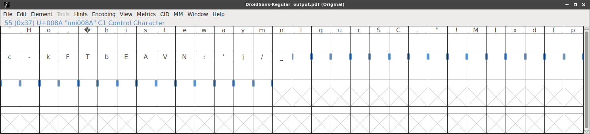

*hint*

## Challenge

Santa has hidden something for you
[here](writeupfiles/HoHoHo_medium.pdf)

## Solution

It's a pdf file, opening in okular popped up that ther was an embedded
font file, named [DroidSans-HACKvent.sfd](DroidSans-HACKvent.sfd) ..with
hackvent in the name, that's got to be hiding our flag!

We used [fontforge][1] to extract the font from the pdf file and view
it:

hmm, we don't see any characters in the boxes, so we select `view->fit
to bounding box`:

And there is our flag! ..looks like the characters were just tiny and
being selectively enlarged in the pdf to create the visible text.

[1]: https://fontforge.github.io/overview.html
