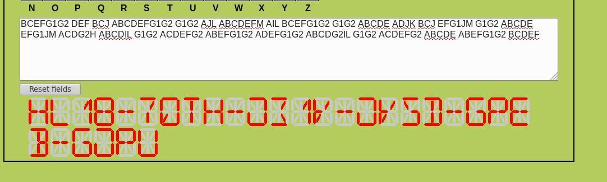

## Challenge

Can you help Santa decoding these numbers?

    115 112 122 127 113 132 124 110 107 106 124 124 105 111 104 105 115 126 124 103 101 131
    124 104 116 111 121 107 103 131 124 104 115 122 123 127 115 132 132 122 115 64 132 103
    101 132 132 122 115 64 132 103 101 131 114 113 116 121 121 107 103 131 124 104 115 122
    123 127 115 63 112 101 115 106 125 127 131 111 104 103 115 116 123 127 115 132 132 122
    115 64 132 103 101 132 132 122 115 64 132 103 101 131 114 103 115 116 123 107 113 111
    104 102 115 122 126 107 127 111 104 103 115 116 126 103 101 132 114 107 115 64 131 127
    125 63 112 101 115 64 131 127 117 115 122 101 115 106 122 107 107 132 104 106 105 102
    123 127 115 132 132 122 116 112 127 123 101 131 114 104 115 122 124 124 105 62 102 101
    115 106 122 107 107 132 104 112 116 121 121 107 117 115 114 110 107 111 121 107 103 131
    63 105 115 126 124 107 117 115 122 101 115 106 122 107 113 132 124 110 107 106 124 124
    105 111 104 102 115 122 123 127 115 132 132 122 115 64 132 103 101 131 114 103 115 116
    123 107 117 115 124 112 116 121 121 107 117 115 114 110 107 111 121 107 103 131 63 105
    115 126 124 107 117 115 122 101 115 106 122 107 107 132 104 106 105 102 121 127 105 132
    114 107 115 64 131 127 117 115 122 101 115 112 122 127 111 132 114 107 105 101 75 75
    75 75 75 75

## Solution

A series of decodings

* Octal
* Base32
* 14-segment display

Decoding script [day02.py](writeupfiles/day02.py):

    import base64
    
    input= "115 112 122 127 113 132 124 110 107 106 124 124 105 111 104 105 115 126 124 103 101 131 124 104 116 111 121 107 103 131 124 104 115 122 123 127 115 132 132 122 115 64 132 103 101 132 132 122 115 64 132 103 101 131 114 113 116 121 121 107 103 131 124 104 115 122 123 127 115 63 112 101 115 106 125 127 131 111 104 103 115 116 123 127 115 132 132 122 115 64 132 103 101 132 132 122 115 64 132 103 101 131 114 103 115 116 123 107 113 111 104 102 115 122 126 107 127 111 104 103 115 116 126 103 101 132 114 107 115 64 131 127 125 63 112 101 115 64 131 127 117 115 122 101 115 106 122 107 107 132 104 106 105 102 123 127 115 132 132 122 116 112 127 123 101 131 114 104 115 122 124 124 105 62 102 101 115 106 122 107 107 132 104 112 116 121 121 107 117 115 114 110 107 111 121 107 103 131 63 105 115 126 124 107 117 115 122 101 115 106 122 107 113 132 124 110 107 106 124 124 105 111 104 102 115 122 123 127 115 132 132 122 115 64 132 103 101 131 114 103 115 116 123 107 117 115 124 112 116 121 121 107 117 115 114 110 107 111 121 107 103 131 63 105 115 126 124 107 117 115 122 101 115 106 122 107 107 132 104 106 105 102 121 127 105 132 114 107 115 64 131 127 117 115 122 101 115 112 122 127 111 132 114 107 105 101 75 75 75 75 75 75"
    
    # looks like ascii encoded in octal
    
    output1 = ""
    for i in input.split(' '):
        output1 += chr(int(i, 8))
    
    print('output1: ', output1)
    
    # looks like base32
    
    output2 = base64.b32decode(output1)
    print('output2: ', output2.upper())
    
    # now what..?
{: .language-python}

This outputs:

    output1:  MJRWKZTHGFTTEIDEMVTCAYTDNIQGCYTDMRSWMZZRM4ZCAZZRM4ZCAYLKNQQGCYTDMRSWM3JAMFUWYIDCMNSWMZZRM4ZCAZZRM4ZCAYLCMNSGKIDBMRVGWIDCMNVCAZLGM4YWU3JAM4YWOMRAMFRGGZDFEBSWMZZRNJWSAYLDMRTTE2BAMFRGGZDJNQQGOMLHGIQGCY3EMVTGOMRAMFRGKZTHGFTTEIDBMRSWMZZRM4ZCAYLCMNSGOMTJNQQGOMLHGIQGCY3EMVTGOMRAMFRGGZDFEBQWEZLGM4YWOMRAMJRWIZLGEA======
    output2:  b'BCEFG1G2 DEF BCJ ABCDEFG1G2 G1G2 AJL ABCDEFM AIL BCEFG1G2 G1G2 ABCDE ADJK BCJ EFG1JM G1G2 ABCDE EFG1JM ACDG2H ABCDIL G1G2 ACDEFG2 ABEFG1G2 ADEFG1G2 ABCDG2IL G1G2 ACDEFG2 ABCDE ABEFG1G2 BCDEF '

This last bit seems to be 14-segment display code, which can be solved
with [this tool][1] from the geocaching toolbox:

And [this site][2] decodes to text directly, giving us the flag:

    HL18-7QTH-JZ1K-JKSD-GPEB-GJPU

(The `HL18` at the start seems to just have been a mistake, and the flag
is accepted like this)

[1]: https://www.geocachingtoolbox.com/index.php?lang=en&page=segmentDisplay
[2]: http://kryptografie.de/kryptografie/chiffre/14-segment.htm
