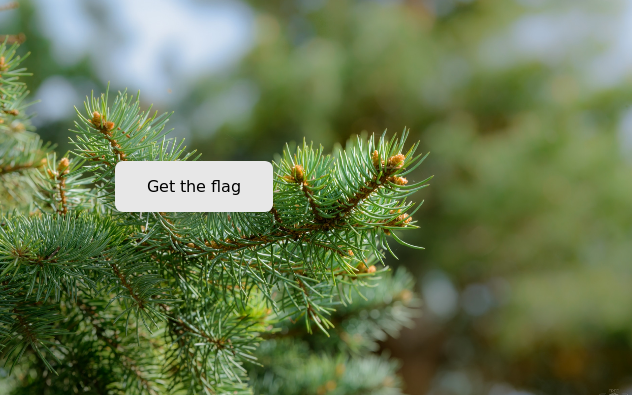
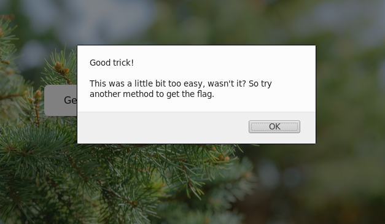
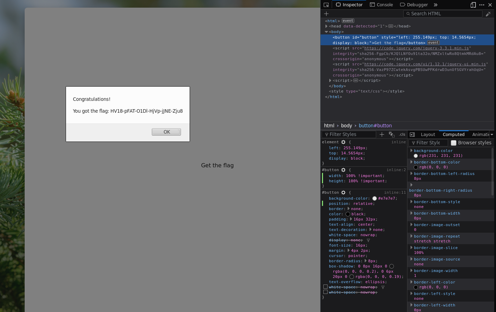

*..if you can*

## Challenge

To get the flag, just press the button

[Catch me][1]

## Solution

The link led to a website with a button to click to get the flag

But the button moves away as you approach it with the mouse, and if you
try using just the keyboard or a touch screen, you get the following
message:

There is some heavily obfuscated javascript on the page:

    var _0x766f = ["\x47\x6F\x6F\x64\x20\x74\x72\x69\x63\x6B\x21\x0A\x0A\x54\x68\x69\x73\x20\x77\x61\x73\x20\x61\x20\x6C\x69\x74\x74\x6C\x65\x20\x62\x69\x74\x20\x74\x6F\x6F\x20\x65\x61\x73\x79\x2C\x20\x77\x61\x73\x6E\x27\x74\x20\x69\x74\x3F\x20\x53\x6F\x20\x74\x72\x79\x20\x61\x6E\x6F\x74\x68\x65\x72\x20\x6D\x65\x74\x68\x6F\x64\x20\x74\x6F\x20\x67\x65\x74\x20\x74\x68\x65\x20\x66\x6C\x61\x67\x2E", "\x43\x6F\x6E\x67\x72\x61\x74\x75\x6C\x61\x74\x69\x6F\x6E\x73\x21\x0A\x0A\x59\x6F\x75\x20\x67\x6F\x74\x20\x74\x68\x65\x20\x66\x6C\x61\x67\x3A\x20\x48\x56\x31\x38\x2D\x70\x46\x41\x54\x2D\x4F\x31\x44\x6C\x2D\x48\x6A\x56\x70\x2D\x6A\x4A\x4E\x45\x2D\x5A\x6A\x75\x38", "\x63\x6C\x69\x63\x6B", "\x23\x62\x75\x74\x74\x6F\x6E", "\x77\x69\x64\x74\x68", "\x68\x65\x69\x67\x68\x74", "\x6F\x75\x74\x65\x72\x57\x69\x64\x74\x68", "\x6F\x75\x74\x65\x72\x48\x65\x69\x67\x68\x74", "\x72\x65\x73\x69\x7A\x65", "\x77\x68\x69\x63\x68", "\x70\x72\x65\x76\x65\x6E\x74\x44\x65\x66\x61\x75\x6C\x74", "\x6B\x65\x79\x64\x6F\x77\x6E", "\x6D\x6F\x75\x73\x65\x65\x6E\x74\x65\x72", "\x70\x61\x67\x65\x58", "\x70\x61\x67\x65\x59", "\x61\x64\x64\x45\x76\x65\x6E\x74\x4C\x69\x73\x74\x65\x6E\x65\x72", "\x6D\x6F\x75\x73\x65\x6D\x6F\x76\x65", "\x6D\x6F\x75\x73\x65\x6F\x76\x65\x72", "\x72\x61\x6E\x64\x6F\x6D", "\x73\x63\x61\x6C\x65", "\x6D\x69\x64\x64\x6C\x65", "\x64\x69\x73\x70\x6C\x61\x79", "\x6E\x6F\x6E\x65", "\x63\x73\x73", "\x68\x69\x64\x65", "\x6C\x65\x66\x74", "\x74\x6F\x70", "\x62\x6C\x6F\x63\x6B", "\x73\x68\x6F\x77", "\x72\x65\x61\x64\x79"];
    $(document)[_0x766f[29]](function() {
        $(_0x766f[3])[_0x766f[2]](function() {
            if (_0xaa99x6 < _0xaa99x4 && _0xaa99x4 < (_0xaa99x6 + _0xaa99x8) && _0xaa99x7 < _0xaa99x5 && _0xaa99x5 < (_0xaa99x7 + _0xaa99x9)) {
                alert(_0x766f[0])
            } else {
                alert(_0x766f[1])
            }
        });
        $(window)[_0x766f[8]](function() {
            if ($(window)[_0x766f[4]]() < 500 || $(window)[_0x766f[5]]() < 400) {
                if (_0xaa99x2 == false) {
                    _0xaa99x2 = true;
                    alert(_0x766f[0]);
                    hideButton()
                }
            } else {
                if (_0xaa99x2 = false) {}
            };
            _0xaa99xa = $(window)[_0x766f[4]]() - $(_0x766f[3])[_0x766f[6]]();
            _0xaa99xb = $(window)[_0x766f[5]]() - $(_0x766f[3])[_0x766f[7]]()
        });
        $(_0x766f[3])[_0x766f[11]](function(_0xaa99x1) {
            if (_0xaa99x1[_0x766f[9]] == 13 || _0xaa99x1[_0x766f[9]] == 32) {
                _0xaa99x1[_0x766f[10]]();
                alert(_0x766f[0])
            }
        });
        var _0xaa99x2 = false;
        var _0xaa99x3 = false;
        var _0xaa99x4 = 0;
        var _0xaa99x5 = 0;
        var _0xaa99x6 = 0;
        var _0xaa99x7 = 0;
        var _0xaa99x8 = $(_0x766f[3])[_0x766f[6]]();
        var _0xaa99x9 = $(_0x766f[3])[_0x766f[7]]();
        document[_0x766f[15]](_0x766f[12], function(_0xaa99x1) {
            _0xaa99x4 = _0xaa99x1[_0x766f[13]];
            _0xaa99x5 = _0xaa99x1[_0x766f[14]]
        }, false);
        $(window)[_0x766f[16]](function(_0xaa99x1) {
            _0xaa99x4 = _0xaa99x1[_0x766f[13]];
            _0xaa99x5 = _0xaa99x1[_0x766f[14]];
            if (_0xaa99xc() && _0xaa99x3 == false) {
                _0xaa99x3 = true;
                _0xaa99xe()
            }
        });
        $(_0x766f[3])[_0x766f[17]](function(_0xaa99x1) {
            _0xaa99x4 = _0xaa99x1[_0x766f[13]];
            _0xaa99x5 = _0xaa99x1[_0x766f[14]];
            if (_0xaa99x3 == false) {
                _0xaa99x3 == true;
                _0xaa99xe()
            }
        });
        var _0xaa99xa = $(window)[_0x766f[4]]() - $(_0x766f[3])[_0x766f[6]]();
        var _0xaa99xb = $(window)[_0x766f[5]]() - $(_0x766f[3])[_0x766f[7]]();
        _0xaa99x6 = _0xaa99xa / 2 + Math[_0x766f[18]]() * _0xaa99xa / 2;
        _0xaa99x7 = _0xaa99xb / 2 + Math[_0x766f[18]]() * _0xaa99xb / 2;
        _0xaa99xe();
    
        function _0xaa99xc() {
            lbx = _0xaa99x6 + _0xaa99x8 / 2;
            lby = _0xaa99x7 + _0xaa99x9 / 2;
            if ((_0xaa99x4 - _0xaa99x6) * (_0xaa99x4 - lbx) + (_0xaa99x5 - lby) * (_0xaa99x5 - lby) < (200 * 200)) {
                return true
            };
            return false
        }
    
        function _0xaa99xd() {
            _0xaa99x6 = (Math[_0x766f[18]]() * _0xaa99xa) % _0xaa99xa;
            _0xaa99x7 = (Math[_0x766f[18]]() * _0xaa99xb) % _0xaa99xb;
            while (_0xaa99xc()) {
                _0xaa99xd()
            }
        }
    
        function _0xaa99xe() {
            $(_0x766f[3])[_0x766f[24]](_0x766f[19], {
                origin: [_0x766f[20], _0x766f[20]]
            }, 100, function() {
                $(_0x766f[3])[_0x766f[23]](_0x766f[21], _0x766f[22]);
                _0xaa99xd();
                _0xaa99xf()
            })
        }
    
        function _0xaa99xf() {
            $(_0x766f[3])[_0x766f[23]](_0x766f[25], _0xaa99x6);
            $(_0x766f[3])[_0x766f[23]](_0x766f[26], _0xaa99x7);
            $(_0x766f[3])[_0x766f[28]](_0x766f[19], {
                origin: [_0x766f[20], _0x766f[20]]
            }, 100, function() {
                $(_0x766f[3])[_0x766f[23]](_0x766f[21], _0x766f[27]);
                _0xaa99x2 = false;
                _0xaa99x3 = false
            })
        }
    });
{: .language-javascript}

..but we cheesed this one a little bit by just changing the size of the
button in CSS to always fill the screen and make it easy to click

    #button {
    	width: 100% !important;
    	height: 100% !important;
    }
{: .language-css}

Now we can easily click the button and collect our flag:

[1]: https://hackvent.hacking-lab.com/C4tchM3_dizzle/
