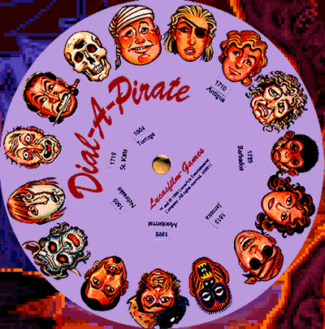
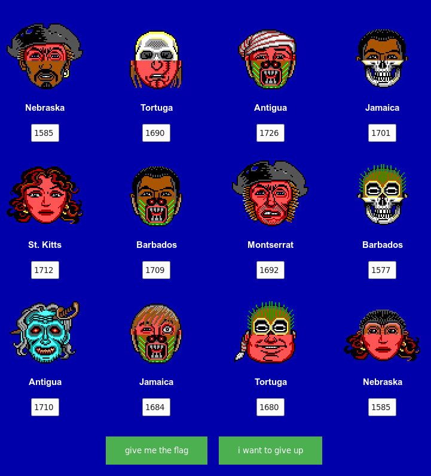

*Ahoy, my name is Santa and I want to be a pirate!*

## Challenge

[Go to the pirates][1]

## Solution

It is a website with 12 pirates with a text box beneath them that need
to be filled with specific values to decrypt the key

    [..]
    
    

      

        
    	
Nebraska

    	
 <input type="text" id="pirate01" size="2">

      

      

    	
    	
Tortuga

    	
 <input type="text" id="pirate02" size="2">

      

      

    	
    	
Antigua

      		
 <input type="text" id="pirate03" size="2">

      

        

    	
    	
Jamaica

    	
 <input type="text" id="pirate04" size="2">

    	

    

    
    [..]
{: .language-html}

and a script to produce the flag:

    function JollyRoger() {
    
    		var elements = document.getElementsByTagName("input")
    		for (var i = 0; i < elements.length; i++) {
    		    if(elements[i].value == "") {
    		        alert('ahoy pirate! \n\nyou want jolly roger? i see empty boxes :-/');
    		        return;
    		    }
    		}
    
    		var a, b;
    		p=document.getElementById('pirate01').value+document.getElementById('pirate02').value+document.getElementById('pirate03').value+
    		document.getElementById('pirate04').value+document.getElementById('pirate05').value+document.getElementById('pirate06').value+
    		document.getElementById('pirate07').value+document.getElementById('pirate08').value+document.getElementById('pirate09').value+
    		document.getElementById('pirate10').value+document.getElementById('pirate11').value+document.getElementById('pirate12').value;
    		s='::)"<.vd]!&a{":r>Qyh 7';
    		f='HV18-';
    		for (i=0; i < s.length;i++) {
    	    	a = s.charCodeAt(i);
    			b = p.substring(i*2, i*2+2);
    			f+=(String.fromCharCode(a ^ b));
    	    }
    	    alert(f);
    	}
{: .language-javascript}

We do know what certain positions in the flag need to decrypt to (e.g.
the dashes), so we can use this to..

`s` is 22 characthers long, and since `p` expects a length up to
`len(s)*2+2`, combined with the fact that the HTML for the names
(Jamaica etc)  
is called `year`, it looks like we need to enter 4 digits in each box.

After some DuckDuckGo'ing, we find out this is a reference to a 90s game
called [The Secret of Monkey Island][2],  
with which a cardboard wheel, named "Dial-a-Pirate", was provided, as a
form of copy-protection. The player had to match the pirate shown
on-screen with that of the wheel.

Instrunctions from game manual:

*Once you've started a program. a screen will appear displaying pirate's
face (actually a combination of two faces). You will be prompted to
enter a date that was significant in the pirate's life at a given
geographical location. Use your Dial-A-Pirate wheel to match up the top
and bottom halves of the pirate face you see on the screen. Then, locate
the window on the wheel that matches the geographical location mentiones
on the screen. Using the keyboard, type the date you see in the window. 

Don't lose your Dial-A-Pirate wheel! Without it, you won't be able to
play the game. If you lose the Wheel, you may purchase another from
Lucasfilm Games.*

There is an working version online [here][3]

So we simply spin the wheel to match the faces in the challenge, and
note the year of the requested place name:

[1]: https://hackvent.hacking-lab.com/Pirates_123/
[2]: https://en.wikipedia.org/wiki/The_Secret_of_Monkey_Island
[3]: http://www.oldgames.sk/codewheel/secret-of-monkey-island-dial-a-pirate
