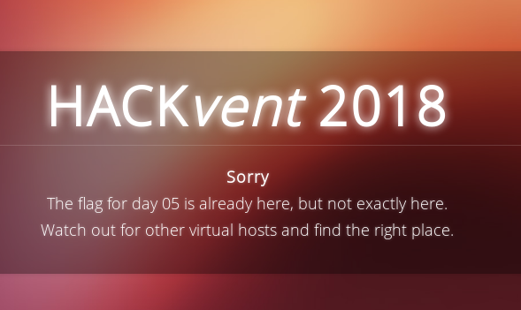

*It's all about transparency*

## Challenge

Santa has hidden your daily present on his server, somewhere on port
443.

Start on https://www.hackvent.org and follow the OSINT traces.

## Solution

We go to the site and see this:

Googling leads us to [certificate transparancy]()

And this site where we can find the other vhost referred to in the
challenge:

https://transparencyreport.google.com/https/certificates

when we visit `osintiscoolisntit.hackvent.org` we are greeted with the
flag:

