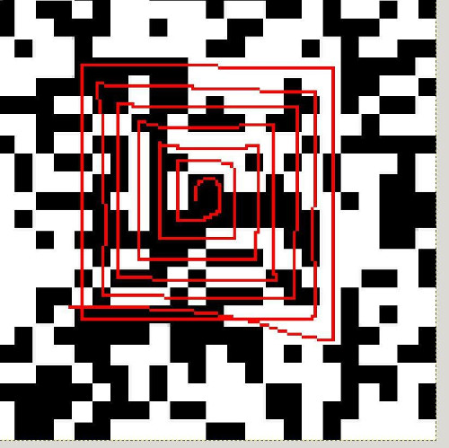

## Challenge

In cyberstan there is a big tradition to backe advents snails during
advent.

## Solution

This looks like it is a barcode, we tried adding the markers for a [data
matrix][1], but this leads nowhere. Given that it is a 25x25 image, it
is likely it is a QR code but somehow encrypted or scrambled.

After a lot of searching (including finding out about [this amusing
service][2]), we realize this is a QR code, but in the shape of a spiral
(like the shell of a snail).

There would be various directions to start from and we could spiral
either clockwise or counterclockwise, but reasoning from the central
pixel, and knowing we would have to start with 7 black pixels for the QR
code corner marker, only one orientation remains:

We write the following script to do the transformation:

    from PIL import Image
    
    
    def getdirection(d):
        ''' change direction, clockwise '''
        if d % 4 == 0:  # up
            return (-1, 0)
        if d % 4 == 1:  # right
            return (0, 1)
        if d % 4 == 2:  # down
            return (1, 0)
        else:  # left
            return (0, -1)
    
    # input image converted to bit string, 1=black, 0=white
    qr = "1101011001101011001101101111000110011111111010000101101101000001001101001010010011100100011000111000110100100000011000101001101000011111100000000111101000111110110000010011001011110011011010001101011000001110011011101100010001110100110100000001011111110101101011000101010001001010001101011001001001100100111100101111110010111110100011011111111100011101001011111110000110001101000000100110111001000001100000101110100011000110100001101000101110110100001100101111111100000010100110101111101111100001100110110011000110110101100111100110110101001000011100101111101010000011001010111011101110110001101100011101101100000110010100000"
    
    # create 2D array
    size = 25
    qr = [qr[i: i + size] for i in range(0, len(qr), size)]
    qr = map(list, qr)
    
    # start in middle
    middle = size / 2
    i = middle
    j = middle
    
    # save transformed bitstring
    outpixels = ""
    
    # paint middle pixel
    outpixels += qr[middle][middle]
    
    # spiral
    p = 0
    stepsize = 1
    direction = 0
    while p <= size*size:
        for _ in range(0, 2):  # same length twice
            d = getdirection(direction)
            for k in range(0, stepsize):
                i += d[0]
                j += d[1]
                try:
                    outpixels += qr[i][j]
                except IndexError:
                    break
            p += stepsize
            direction += 1
        stepsize += 1
    
    # create an image
    outimg = Image.new('RGB', (size, size), "white")
    pixels = outimg.load()
    
    for i in range(0, size*size):
        if outpixels[i] == "1":
            pix = (0, 0, 0)
        else:
            pix = (255, 255, 255)
        pixels[i / size, i % size] = pix
    
    # save image
    outimg = outimg.resize((500, 500))
    outimg.save("day08-snail-out.png")
{: .language-python}

Which outputs the following QR code:

[1]: https://en.wikipedia.org/wiki/Data_Matrix
[2]: http://realsnailmail.net
