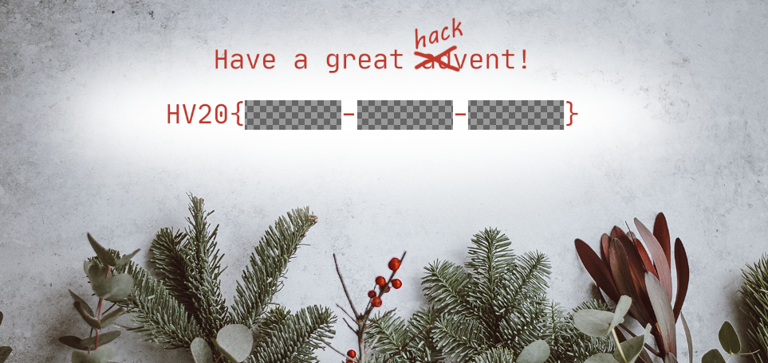

## Description

Welcome to this year's HACKvent.

Attached you can find the "Official" invitation to the HackVent.

One of my very young Cyber Elves cut some parts of the card with his
alpha scissors.

Have a great HACKvent,

– Santa

## Solution

opening it in GIMP doesn't lead anywhere, we see the code has been cut
out with the "alpha scissors":

but running exiftool gives us a hint

    $ exiftool dec1.png
    ExifTool Version Number         : 1.88
    File Name                       : 1.png
    Directory                       : writeupfiles
    File Size                       : 2.5 MB
    File Modification Date/Time     : 2020:12:01 20:11:37+01:00
    File Access Date/Time           : 2020:12:01 20:13:25+01:00
    File Inode Change Date/Time     : 2020:12:01 20:11:37+01:00
    File Permissions                : rw-rw-r--
    File Type                       : PNG
    File Type Extension             : png
    MIME Type                       : image/png
    Image Width                     : 1600
    Image Height                    : 900
    Bit Depth                       : 8
    Color Type                      : RGB with Alpha
    Compression                     : Deflate/Inflate
    Filter                          : Adaptive
    [..]
    Background Color                : 255 255 255
    Pixels Per Unit X               : 2835
    Pixels Per Unit Y               : 2835
    Pixel Units                     : meters
    Modify Date                     : 2020:11:17 07:39:19
    Image Size                      : 1600x900
    Megapixels                      : 1.4
    Thumbnail Image                 : (Binary data 8609 bytes, use -b option to extract)
{: .language-bash}

There is a thumbnail image embedded, lets see if that has more info in
it!

    $ exiftool -b -ThumbnailImage dec1.png > dec1_thumbnail.png
{: .language-bash}

Aha! we can still see the flag on here!

## Flag

    HV20{7vxFXB-ItHnqf-PuGNqZ}

