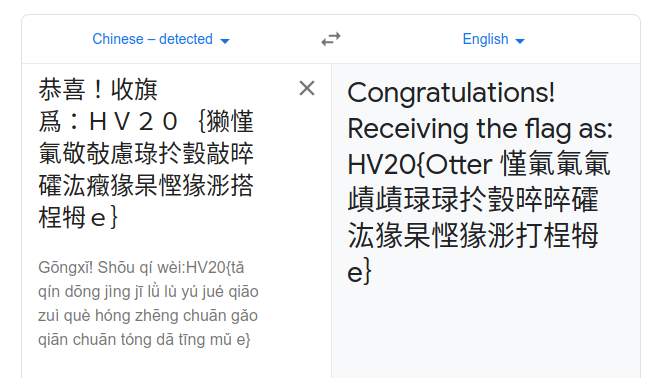

## Description

I've received this note from a friend, who is a Chinese CTF player:

    恭喜！收旗爲：ＨＶ２０｛獭慬氭敬敧慮琭扵瑴敲晬礭汯癥猭杲慳猭浵搭桯牳ｅ｝

Unfortunately, Google Translate wasn't of much help:

I suspect the data has somehow been messed up while transmitting it.

Sadly, I can't ask my friend about more details. The Great Chinese
Firewall is thwarting our attempts to reach each other, and there's no
way I'm going to install WeChat on my phone.

## Solution

Google Translate gives the following:

Congratulations: 恭喜  
Flag collection: 收旗爲

While attempting to convert it into utf16, it turned out that was the
solution?

    $ iconv -f UTF-8 -t UTF-16LE writeupfiles/dec2.txt
    msla-llegena-tubttrelf-yolev-srgsa-sum-dohsrE
    $ iconv -f UTF-8 -t UTF-16BE writeupfiles/dec2.txt
    small-elegant-butterfly-loves-grass-mud-horsE

or the python approach:

    >>> ct = '獭慬氭敬敧慮琭扵瑴敲晬礭汯癥猭杲慳猭浵搭桯牳'
    >>> ct.encode("utf-16be")
    b'small-elegant-butterfly-loves-grass-mud-hors'
{: .language-python}

and just add the `e` at the end from the original challenge to get the
flag:

## Flag

    HV20{small-elegant-butterfly-loves-grass-mud-horse}

