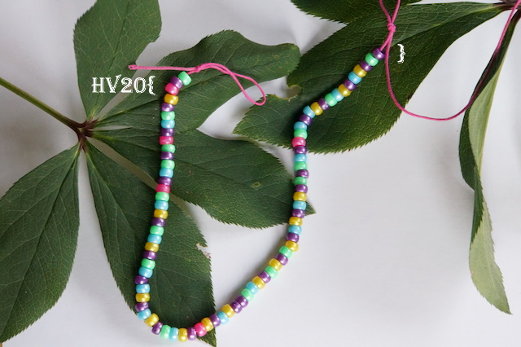

## Description

Santa was given a nice bracelet by one of his elves. Little does he know
that the secret admirer has hidden a message in the pattern of the
bracelet...

Hints:

* No internet is required - only the bracelet
* The message is encoded in binary
* Violet color is the delimiter
* Colors have a fixed order
* Missing colors matter

## Solution

Lets start by transcribing the beads of the bracelet, and we know that
purple is a delimiter

    g|py|gb|pg|gb|pgby|gby|gb|by|by|gby|py|by||gby|gy|gy|by|by|g|gb|pgb|by|gby|by|g|
    
    
    g=green
    p=pink
    y=yellow
    b=blue

Given the clues that the order is always the same, we suspect that each
color represents a place in the binary number, and presence of the bead
means a `1` in that position, and absence of the color bead a `0`

we have one grouping with all colors, so we know the order is `pgby`,
and if all beads are present, it corresponds to `1111`, and if none are
present it is `0000` etc

    pgby
    ----
    0000
    0001 y
    0010 b
    0011 by
    0100 g
    0101 gy
    ..etc

then to convert this to ascii characters, two groups form one letter

Transcribing the whole bracelet gives the following binary code:

    01001001 01101100 01101111 01110110 00110011 01111001 00110000 01110101 01010011 00110100 01101110 00110111 00110100

which when converted to ascii spells `Ilov3y0uS4n74`

