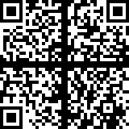
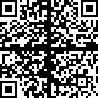
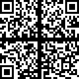

## Description

On the sixth day of Christmas my true love sent to me...

six valid QRs,  
five potential scrambles,  
four orientation bottom and right,  
and the rest has been said previously.

[source image (.pxd)](writeupfiles/dec6.pxd)

## Solution

This is cool, I love Rubik's cubes! Unfortunately I don't have a
printer, so we are going to solve this in-silico :)

We cut out all the squares with GIMP, and use python to generate all
possible combinations of QR-quarters, and find the flag

    from PIL import Image
    from pyzbar.pyzbar import decode
    import glob, itertools
    
    def concat_h(im1, im2):
        dst = Image.new('RGB', (im1.width + im2.width, im1.height))
        dst.paste(im1, (0, 0))
        dst.paste(im2, (im1.width, 0))
        return dst
    
    def concat_v(im1, im2):
        dst = Image.new('RGB', (im1.width, im1.height + im2.height))
        dst.paste(im1, (0, 0))
        dst.paste(im2, (0, im1.height))
        return dst
    
    
    # load image parts
    qrblocks = [Image.open(a) for a in glob.glob("dec6-qrcodes/good_tr/*.png")]
    qrbr = [Image.open(a) for a in glob.glob("dec6-qrcodes/br/*.png")]
    perm = itertools.permutations(qrblocks,3)
    
    found = 0
    for i in perm:
      tl = i[0].rotate(90)
      tr = i[1]
      bl = i[2].rotate(180)
      for br in qrbr:
        top = concat_h(tl,tr)
        bottom = concat_h(bl,br)
        final = concat_v(top,bottom)
        dec = decode(final)
        if dec != []:
          print(dec[0].data)
          final.save("dec6_qrcode"+str(found)+".png")
          found+=1
{: .language-python}

This gives the following output:

    b'HV20{Erno_                                                      '
    b'_be_proud.                                                      '
    b'Rubik_would                                                     '
    b'#HV20QRubicsChal}                                               '
    b'_Valid.                                                         '
    b'Petrus_is                                                       '

whoo! we found all the fragments! Now its just a matter of putting them
in the right order and we have our flag :)

These were the qr images

  
  
  
  
  

## Flag

    HV20{Erno_Rubik_would_be_proud.Petrus_is_Valid.#HV20QRubicsChal}

