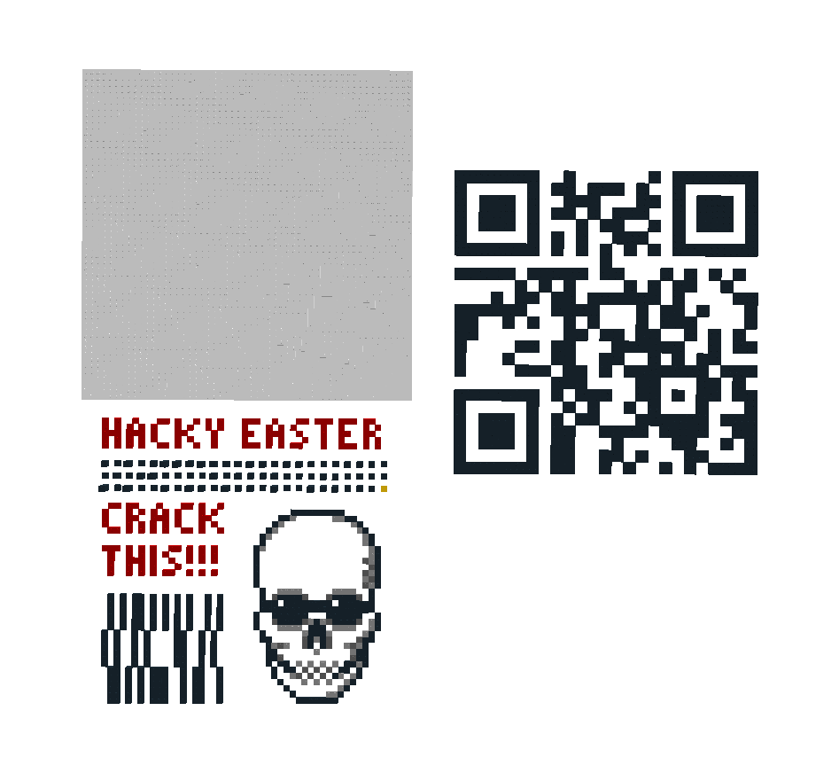

## Challenge:

*You intercepted a message sent by a nerd from the office nearby. On
first sight, there's nothing suspicious in it.*
*However, you are almost sure that something secret must be hidden in
it. Can you find out what?*

[file](images/legostego.lxf)

## Solution:

we open the file in lego builder app [link]() and see the following
model:

we see some barcode-like pattern near the bottom, could be binary

    01010110101010100101
    10100101000011001010
    01101010111001011001

..but this leads nowhere..

aha! if we rotate the model we see that the dots on the top are also
different heights:

we transcribe the heights:

    214124434323432332113221
    121341111313213121331211
    414113143142314114341211

..can't make any sense out of it..

We go back to the model and pull apart the different layers, and yes! a
QR code is revealed:

