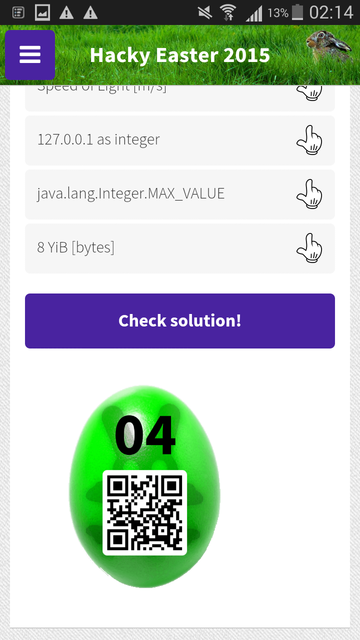

## Challenge:
*Your teacher was right when he said that math is useful in your whole
life.*

*Calculate/convert the following values, and sort them in ascending
order.*

10101111000
8YiB \[bytes\]
Speed of Light \[m/s\]
127.0.0.1 as integer
Pi^Pi
java.lang.Integer.MAX\_VALUE
13 MiB \[bytes\]
2^20
ZmlmdHk=
sqrt(1296)
303240 base 8
Middle C \[Hz\]

## Solution:

sqrt(1296)=36
Pi^Pi=36.4621596072
ZmlmdHk=fifty
Middle C \[Hz\] = 261.625565
10101111000=1400
303240 base 8 = 100,000
2^20= 1,048,576
13 MiB \[bytes\] = 13\* 1,048,576 = 13,631,488
Speed of Light \[m/s\] = 299,792,458
127.0.0.1 as integer = 2,130,706,433
java.lang.Integer.MAX\_VALUE=2^31 -1=2,147,483,647
8YiB \[bytes\]=8\* 1208925819614629174706176= 1.57160e25

This gives us the QRcode:

