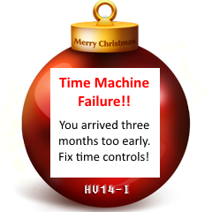

## Challenge:

*The Doc's in trouble again, and you must come to his rescue! As you
jump into his time machine, you realize that a password is needed to
start it. Just in that moment of despair, you receive an audio message
from the Doc, through space and time:*

    dah-dah-dit dit dah-dah-dah di-dah-dit dah-dah-dit dit dah-dah dah-di-dah-dit di-di-dah-dit di-dah-di-dit dah-di-dah-dah

## Solution

convert to morse using dah=long, di/dit=short and the following chart

This gives us the answer:

    --. . --- .-. --. .   -- -.-. ..-. .-.. -.--
    G   E  O   R   G  E   M   C    F    L    Y

we enter this password and get a Hackvent Christmas Bauble :P

It says we arrived three months too early and to fix time controls..

we check the source and see the following snippet:

    function getEgg() {
      emptyScrambledEgg();
      var key = $("#scrambledEggKey").val();
      $.getJSON("time?m=" + new Date().getMonth() + "&k=" + key, function( data ) {
         document.getElementById('scrambledEggImage').setAttribute( 'src', 'data:image/png;base64,' + data.egg );
      });
    }

we see that the current month is checked when getting the result image,
so we manually get the image
with month 6 passed instead of 3:

    http://hackyeaster.hacking-lab.com/hackyeaster/time?m=6&k=georgemcfly

we get base64 encoding of the image, and after translation gives us the
egg14\_qrcode

