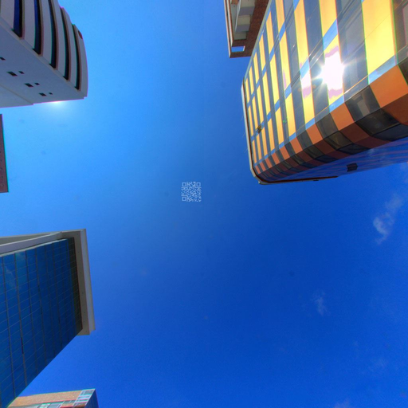

## Challenge:

*This egg is hidden in a street-view like viewer. Peek around the area
to find it!*

## Solution:

We look in the [apk](images/HackyEaster_2.0.apk) of the HackyEaster app,
and find the images used in the streetview app (in `/res/raw/`). Among
it the one containing the QRcode in the sky:

The QRcode needs some enhancing before it can be scanned. We edit it in
gimp, (increase contrast, substitute colors with black/white, and draw a
white border around it). This gives us a scannable QR code:

