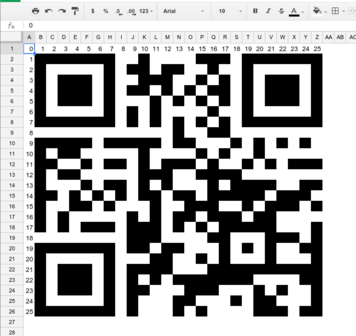

## Challenge:

*This egg is hidden within an online spreadsheet. Go find it's URL, and
extract the egg out of it.*

*Spreadsheet ID:*

    1QPkfrnSVRAhQKL7AZx_HVXWrRXDvwCnVX2ih0jYp1CA

## Solution:

We go to Google sheets and see if there is a spreadsheet with that id.
There is:
[https://docs.google.com/spreadsheets/d/1QPkfrnSVRAhQKL7AZx\_HVXWrRXDvwCnVX2ih0jYp1CA/][1]

This looks like it may be a scrambled QR code. We rearrange the rows and
columns until they are in order (as signified by the numbers in the
first row and first column). This gets us our QRcode:

[1]: https://docs.google.com/spreadsheets/d/1QPkfrnSVRAhQKL7AZx_HVXWrRXDvwCnVX2ih0jYp1CA/
