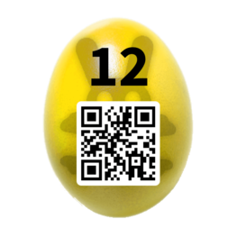

## Challenge:

*This is your chance to become a Certified Easter Hacker (CEH)! Complete
the following little test. Passing score is 100%*.

**Question 1**
What is the name of the popular port scanner, implemented by Fyodor?

**Question 2**
In the context of PKI systems, the shorthand "CRL" stands for
"certificate **\_\_**{::}*\_\_* list".

**Question 3**
A group of 100 people plans to use symmetric encryption for secure
communication. How many keys are needed to let everybody communicate
with each other?

**Question 4**
Which hash sizes are supported by the SHA2 family? Choose two!
192 bit
384 bit
448 bit
512 bit

**Question 5**
Which port number is used by Kerberos?

## Solution:

The answers to the questions are:

Q1: nmap
Q2: revocation
Q3: 4950 ( 100+99+98+..+1, or n\*(n+1)/2 )
Q4: 384 and 512
Q5: 88

But the form will not let you enter the these values, so we adjust the
html:

```html
    <form method="post" action="ceh">
      <article class="box post">
        <header id="challenge-header"></header>
        <script>addChallengeHeader()</script>
        <p>
          This is your chance to become a Certified Easter Hacker (CEH)! Complete the following little test. Passing score is 100%.
        </p>
        <p>
          <b>Question 1</b><br/>
          What is the name of the popular port scanner, implemented by Fyodor?<br/>
          <input type="text" name="q1" autocapitalize="off" autocorrect="off" placeholder="all lowercase" onblur="this.value = 'metasploit';"></input>
        </p>
        <p>
          <b>Question 2</b><br/>
          In the context of PKI systems, the shorthand "CRL" stands for "certificate __________ list".<br/>
          <input type="number" name="q2" autocapitalize="off" autocorrect="off" placeholder="all lowercase"></input>
        </p>
        <p>
          <b>Question 3</b><br/>
          A group of 100 people plans to use symmetric encryption for secure communication. How many keys are needed to let everybody communicate with each other?<br/>
          <input type="text" name="q3" autocapitalize="off" autocorrect="off" placeholder="all lowercase" maxlength="3"></input>
        </p>
        <p>
          <b>Question 4</b><br/>
          Which hash sizes are supported by the SHA2 family? <b>Choose two</b>!<br/>
          <input type="radio" name="q4" value="192">192 bit</input><br/>
          <input type="radio" name="q4" value="384">384 bit</input><br/>
          <input type="radio" name="q4" value="448">448 bit</input><br/>
          <input type="radio" name="q4" value="512">512 bit</input>
        </p>
        <p>
          <b>Question 5</b><br/>
          Which port number is used by Kerberos?<br/>
          <select name="q5">
            <option value="0">please choose</option>
            <option value="53">53</option>
            <option value="139">139</option>
            <option value="161">161</option>
            <option value="8080">8080</option>
          </select>
        </p>
        <p>
          <button type="submit" name="success" value="false">Submit Test</button>
        </p>
      </article>
    </form>
```

For question one, remove `onblur="this.value = 'metasploit';"`
For question two, change type from number to text
For question three, set `maxlength`to 4
For question four, change input type to `checkbox`
For question five, change value of one of the options to 88 and select
that option
For the button, change value to `true`

Now you can submit the correct answers and get the egg14\_qrcode



