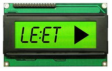

## Challenge:

*Welcome to Leet TV! Click the image below to play our trailer.*

## Solution:

The [movie](images/egg_13_movie.mp4) shows a different QRcode every
seconds, we tried scanning a few
of them at random, but they are not recognized by the app

from the image in the challenge description we freeze the movie at 13:37
and try that QR code

but the response we get from the app is

    Nope! That's not an egg!

We scan the image with a barcode reader other than the one embedded in
the app to see what value
it contains:

    http://bit.ly/1BJENx8

This location contains an [audio file](images/egg_13_leettv.wav)

It doesn't sound like it contains anything useful, but when we play it
in reverse we hear

    eight forty-two

so we pause the video at 08:42 and scan the QRcode there

