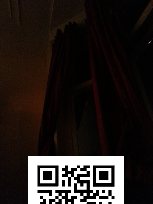

## Challenge:

\[mobile challenge\]

*Your gallery needs some nice easter snapshots! What about a nice
grassland panorama, or a still life of a tomato?*

\[button to take snapshot\]

## Solution:

We take a random picture with the app and find the resulting image:

We do this a few more times with the same result.

Then we try to do what the hints says and take a picture of a grassland
panorama ..we even see one
right on the hacky easter website

wow! half a QR code!

now to find the other half..

We try a lot of tomatoes but nothing works ..in pure desperation I
started taking a bunch of random
pictures until I finally got one with the other half of the QR code:

putting the two together gives the QR code:

We got the answer, but still not quite sure how we did it ..curious to
see the writeups by others
once this is all over..

