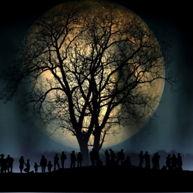

## Challenge:

*Ghosts only come out when it's dark...*

banner:

## Solution:

First we try to see if there is anything hidden in the image, but to no
avail..

later we notice a reference to `dark` in the source of the challenge
overview page,

    $('#footer-wrapper').append(
         '' +
         '<a href="#" onclick="javascript:toggleDark();"></img></a>' +
         ''
    );

So we click this button, and now the banner for the challenge has
changed

and so has the description

    Dark is beautiful. A GOST with chaining appears and has a message for you:

    d5++xytj6RiGwmqEecm63Kow7RZGAAHh
    VFsksHFuj/Anap7pWHDZ1XQw8DAApUEN
    R5ExOGUKTzGOtvSAlCHkHq6NneL6ZUTX
    ej8Taxz+kHK9w9U8dxTOSksZ4HKS2YYD

GOST is a hashing algorithm ([wiki link][1]).

    d5++xytj6RiGwmqEecm63Kow7RZGAAHhVFsksHFuj/Anap7pWHDZ1XQw8DAApUENR5ExOGUKTzGOtvSAlCHkHq6NneL6ZUTXej8Taxz+kHK9w9U8dxTOSksZ4HKS2YYD
^

    779fbec72b63e91886c26a8479c9badcaa30ed16460001e1545b24b0716e8ff0276a9ee95870d9d57430f03000a5410d47913138650a4f318eb6f4809421e41eae8d9de2fa6544d77a3f136b1cfe9072bdc3d53c7714ce4a4b19e07292d98603

[1]: http://en.wikipedia.org/wiki/GOST_%28hash_function%29
