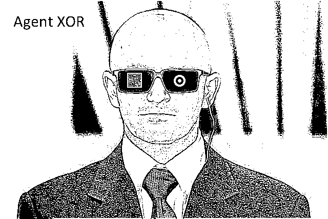
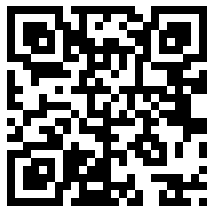
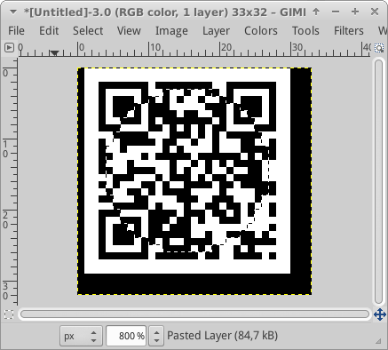
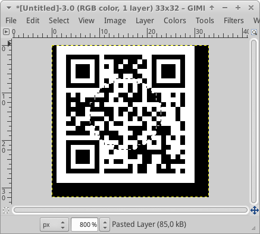
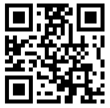

## Challenge:

*Sharpen your eyes, and find the difference of the two images below!*

## Solution:

We check for LSB steganography by comparing the pixel values for both
images. if the LSB differs between the two images we draw a black pixel
in our output image, if they do not we draw a white pixel

    from PIL import Image

    img1 = Image.open("egg_17_difference1.bmp")
    img2 = Image.open("egg_17_difference2.bmp")

    pixels1 = img1.load() # create the pixel map
    pixels2 = img2.load() # create the pixel map

    (w,h)=img1.size

    # create new image to which we will write hidden image
    outimg = Image.new( 'RGB', (w,h), "white")
    pixels_out = outimg.load()

    for i in range(0,h):
        for j in range(0,w):
          (r1,g1,b1) = pixels1[j,i]
          (r2,g2,b2) = pixels2[j,i]

          if r1!=r2:
              (r,g,b)=(255,255,255)
          else:
              (r,g,b)=(0,0,0)

          pixels_out[j,i] = (r,g,b)

    outimg.save("egg_17_result.png","png")
{: .language-python}

this gives the following image:

We see a QRcode in the image, however, it will not scan because it is
distorted:

Below is an explanation of the QRcode format:

* The three large squares highlighted in red are the position markers.
  These tell the scanner where the edges of the code are.
* The smaller red square is an alignment marker. This acts as a
  reference point for the scanner, making sure everything lines up
  properly. In bigger codes, there are several of these squares.
* The red strips of alternating black and white modules are called
  timing patterns. They define the positioning of the rows and columns.
* The green sections determine the format. This tells the scanner
  whether it’s a website, text message, Chinese symbols, numbers, or any
  combination of these.
* The modules highlighted in blue represent the version number.
  Basically, the more modules in the code, the higher the version (up to
  v40, which is 177×177 modules). If the code is version 6 or smaller,
  the version does not need to be defined here because the scanner can
  literally count the modules and determine the version on its own.

It appears that the pixels in a circular area in the middle or the
QRcode need to be inverted in order to create the three position markers
in the corners.
After we do that, we see we need to apply the same trick again with a
smaller circle in order to fix the alignment marker.

We can do this in GIMP:

which gets us the following QR code:

