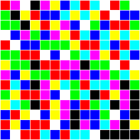

## Challenge:

*Tired of boring QR codes, Dr. Bunny C. Easter developed an alternative.
He's proudly introducing the "Cony Code" now! Crack the code in order to
get another easter egg!*

*Hint: 110 is blue, the rest's up to you...*

## Solution:

The hint suggest we can substitute each coloured square for a 3-digit
binary number, we just need to figure out the binary codes corresponding
to each colour.

Since blue is 110, it could be inverted RGB? (i.e. red=011, green=101,
blue=110, etc..)

following this logic we get the following rules:

    red     = 011 (= r )
    green   = 101 (= g )
    blue    = 110 (= b )
    yellow  = 001 (= y )
    magenta = 010 (= m )
    cyan    = 100 (= c )
    black   = 111 (= bl)
    white   = 000 (= w )

the image has the following colors:

    r-m-w-bl-m-y-b-c-r-c-w-r-g-w
    g-bl-y-r-b-b-c-y-c-y-r-w-b-b
    g-g-bl-y-r-y-m-b-w-g-b-r-r-g
    w-b-m-g-b-m-y-r-c-b-c-y-c-y
    r-w-b-b-g-g-g-y-r-r-c-b-r-c
    g-g-r-r-w-b-w-g-c-m-y-r-c-b
    y-g-g-bl-r-r-m-m-bl-g-g-w-r-w
    m-b-y-g-g-r-r-b-m-b-m-g-c-y
    r-c-b-bl-m-y-c-g-r-c-c-m-bl-g
    g-y-r-r-m-b-w-g-c-bl-r-y-m-bl
    y-c-g-bl-r-y-m-b-r-g-c-bl-m-bl
    b-r-y-w-b-y-m-bl-b-b-g-w-b-bl
    r-y-b-r-r-w-b-bl-m-b-c-m-bl-y
    b-w-r-r-c-b-r-c-c-w-bl-bl-bl-bl

Substituting the colours with the binary codes gives us:

    011010000111010001110100011100000011101000
    101111001011110110100001100001011000110110
    101101111001011001010110000101110011011101
    000110010101110010001011100110100001100001
    011000110110101101101001011011100110011100
    101101011011000110000101100010001011100110
    001101101111011011010010111101101000011000
    010110001101101011011110010110010101100001
    011100110111010001100101011100100010111101
    101001011011010110000101100111011001010111
    001100101111011001010110011101100111010111
    110011001000110001010111110110101000110111
    011001110011011000110111010110100010111001
    110000011011100110011100100000111111111111

which, when translated to ascii gives (removing the trailing `1`s):

    http://hackyeaster.hacking-lab.com/hackyeaster/images/egg_21_j7g67Z.png

