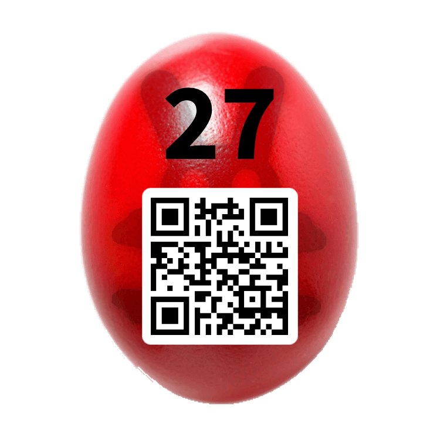

## Challenge:

You intercepted messages exchanged by evil Dr. Hopper and his agents.
They used a One Time Pad for achieving perfect secrecy. Lucky for you,
they have miserably failed, since the same key was used multiple times.

Check out the ciphertexts, and try to decrypt them. Hint: The plain
texts consist of lowercase letters and spaces only.

    60c46964f83879618e2878de539f6f4a6271d716
    63c37a6ca177792092602cc553c9684b
    68d82c6bf4767f79dd617f9642d768057f63c1
    6c8a7b6ce06a3161dd6a60d755d42d4d6d67
    71c26929e96931698e2865d816d3624b687cd6
    6cda6d6df87764709c6c7bd357d361556d77

## Solution (not mine):

    def strxor(a, b):     # xor two strings of different lengths
        if (len(a) > len(b)):
            return "".join([chr(ord(x) ^ ord(y)) for (x, y) in zip(a[:len(b)], b)])
        else:
            return "".join([chr(ord(x) ^ ord(y)) for (x, y) in zip(a, b[:len(a)])])

    MSGS = ['60c46964f83879618e2878de539f6f4a6271d716', '68d82c6bf4767f79dd617f9642d768057f63c1', '6c8a7b6ce06a3161dd6a60d755d42d4d6d67', '71c26929e96931698e2865d816d3624b687cd6', '6cda6d6df87764709c6c7bd357d361556d77', '63c37a6ca177792092602cc553c9684b']

    #mensaje = "mr bunny is the spy"
    mensaje = "five oh oh seven"
    #mensaje = "enemy has the bomb"
    llave = strxor(MSGS[-1].decode('hex'), mensaje)

    print ":" + strxor(MSGS[-1].decode('hex'), llave)
    for pos in range(len(MSGS)):
        print strxor(MSGS[pos].decode('hex'), llave)
{: .language-python}

