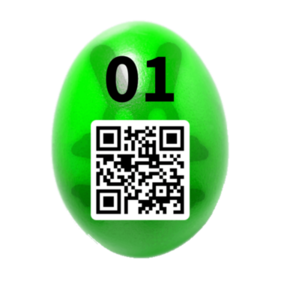
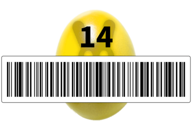
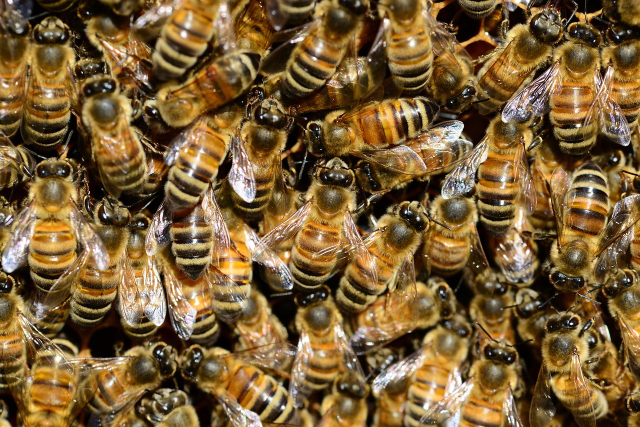
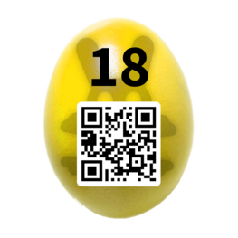
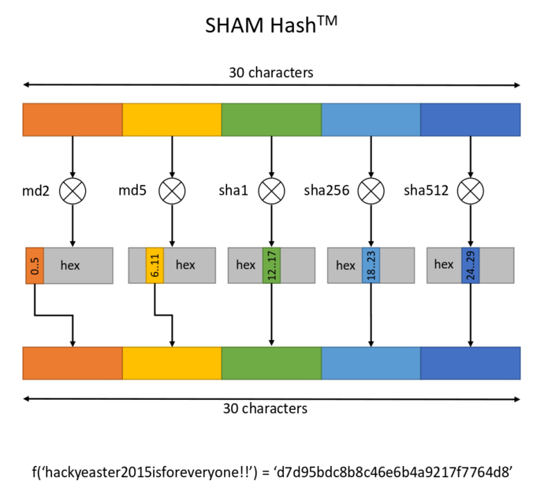

# Egg 1: **Puzzword**

**Challenge:**  

*Warming up with a simple one...*

*Search out the password in the image. Then jump up twice and grab the egg in the Egg-O-Matic below.*


**Solution:**  

The missing letters in the image can be arranged to spell *hackerz*    


We enter this into egg-o-matic to get the QRcode  




# Egg 2: **It's in the Media**

**Challenge:**  

*New York Times, March 12 2015*  
*An Easter Egg of the famous Hacky Easter white-hat hacking competition, was leaked last Tuesday by the*   
*famous hacker group "Bunnonymous". Experts confirmed its authenticity, but could not crack the code hidden it in yet.*   

Can you do better?   


**Solution:**  

The QR code is made in HTML ([source code](images/challenge02.html)), but is invalid 


(notice the block with NO overlaid on the QRcode)

In the source we see:

```
.page { background-color: white !important;} 
.h { display:none;} 
.i3 { height: 10px; width: 10px; background: #fff;}
.o2 { height: 10px; width: 10px; background: #000;}
.l1 { height: 10px; width: 10px; background: #000;}
.x5 { height: 10px; width: 10px; background: #fff;}
@media print {	body {-webkit-print-color-adjust: exact;}
		.h { display:block;}
		.l1 { height: 10px; width: 10px; background: #000;}
		.x5 { height: 10px; width: 10px; background: #000;}
	      }"
```

If we change style of element class `.x5` (first occurrence) to white, we can read the egg:


# Egg 3: **Lego Stego**

**Challenge:**  

*You intercepted a message sent by a nerd from the office nearby. On first sight, there's nothing suspicious in it.*   
*However, you are almost sure that something secret must be hidden in it. Can you find out what?*   

[file](images/legostego.lxf)

**Solution:**  

we open the file in lego builder app [link]() and see the following model:


we see some barcode-like pattern near the bottom, could be binary

```
01010110101010100101 
10100101000011001010 
01101010111001011001 
```

..but this leads nowhere..

aha! if we rotate the model we see that the dots on the top are also different heights:


we transcribe the heights:

```
214124434323432332113221
121341111313213121331211
414113143142314114341211
```

..can't make any sense out of it..

We go back to the model and pull apart the different layers, and yes! a QR code is revealed:


# Egg 4: **Twisted Num63rs**

**Challenge:**  
*Your teacher was right when he said that math is useful in your whole life.*   

*Calculate/convert the following values, and sort them in ascending order.*  


10101111000  
8YiB [bytes]  
Speed of Light [m/s]  
127.0.0.1 as integer  
Pi^Pi  
java.lang.Integer.MAX_VALUE  
13 MiB [bytes]  
2^20  
ZmlmdHk=  
sqrt(1296)  
303240 base 8  
Middle C [Hz]  


**Solution:**  

sqrt(1296)=36  
Pi^Pi=36.4621596072  	
ZmlmdHk=fifty  
Middle C [Hz] = 261.625565  
10101111000=1400  
303240 base 8 = 100,000  
2^20= 1,048,576  
13 MiB [bytes] = 13* 1,048,576 = 13,631,488  
Speed of Light [m/s] = 299,792,458  
127.0.0.1 as integer = 2,130,706,433  
java.lang.Integer.MAX_VALUE=2^31 -1=2,147,483,647  
8YiB [bytes]=8* 1208925819614629174706176= 1.57160e25  


This gives us the QRcode:


# Egg 5: **Phone Fumbling**

**Challenge:**  

(Mobile Challenge)  

*In this challenge, you need to play with your phone a bit.*   
*Try to find out what controls the four bars, and make them*   
*reach the full width (all at the same time).*    


**Solution:**  

Below are my suspicions on what each bar does  

*bar 1:* top bar appears to change with the number of seconds since the last full minute, so will reach full width every minute.  

*bar 2:*  was already full for me, number of bars connectivity?  

*bar 3:*  compass direction. point your phone due north to get full width  

*bar 4:*  battery charge (charge to full to get to full width)  


# Egg 6: **Hack to the Future**

**Challenge:**  

*The Doc's in trouble again, and you must come to his rescue! As you jump into his time machine, you realize that a password is needed to start it. Just in that moment of despair, you receive an audio message from the Doc, through space and time:*   

```
dah-dah-dit dit dah-dah-dah di-dah-dit dah-dah-dit dit dah-dah dah-di-dah-dit di-di-dah-dit di-dah-di-dit dah-di-dah-dah
```

convert to morse using dah=long, di/dit=short and the following chart


This gives us the answer:

```
--. . --- .-. --. .   -- -.-. ..-. .-.. -.--
G   E  O   R   G  E   M   C    F    L    Y
```
we enter this password and get a Hackvent Christmas Bauble :P


It says we arrived three months too early and to fix time controls..

we check the source and see the following snippet:

```
function getEgg() {
  emptyScrambledEgg();
  var key = $("#scrambledEggKey").val();
  $.getJSON("time?m=" + new Date().getMonth() + "&k=" + key, function( data ) {
     document.getElementById('scrambledEggImage').setAttribute( 'src', 'data:image/png;base64,' + data.egg );
  });
}
```

we see that the current month is checked when getting the result image, so we manually get the image
with month 6 passed instead of 3:

```
http://hackyeaster.hacking-lab.com/hackyeaster/time?m=6&k=georgemcfly
```

we get base64 encoding of the image, and after translation gives us the egg14_qrcode


**Solution:**  


# Egg 7: **Vista de la Calle**

**Challenge:**  

*This egg is hidden in a street-view like viewer. Peek around the area to find it!*

**Solution:**  

We look in the [apk](images/HackyEaster_2.0.apk) of the HackyEaster app, and find the images used in the streetview app (in `/res/raw/`). Among it the one containing the QRcode in the sky:


The QRcode needs some enhancing before it can be scanned. We edit it in gimp, (increase contrast, substitute colors with black/white, and draw a white border around it). This gives us a scannable QR code:


# Egg 8: **Spread the Sheet**

**Challenge:**  

*This egg is hidden within an online spreadsheet. Go find it's URL, and extract the egg out of it.*  

*Spreadsheet ID:*   
```
1QPkfrnSVRAhQKL7AZx_HVXWrRXDvwCnVX2ih0jYp1CA  
```

**Solution:**  

We go to Google sheets and see if there is a spreadsheet with that id. There is: 
[https://docs.google.com/spreadsheets/d/1QPkfrnSVRAhQKL7AZx_HVXWrRXDvwCnVX2ih0jYp1CA/](https://docs.google.com/spreadsheets/d/1QPkfrnSVRAhQKL7AZx_HVXWrRXDvwCnVX2ih0jYp1CA/)


This looks like it may be a scrambled QR code. We rearrange the rows and columns until they are in order (as signified by the numbers in the first row and first column). This gets us our QRcode:


# Egg 9: **Fisheye**

**Challenge:**  
[mobile challenge]

*Egg  number nine is hidden in the app. You've already seen it, haven't you?*

*Go catch it and squint like a fish*

**Solution:**  

The (distorted) image of the egg is the splash screen of the app. In the [apk]() we find the image:


we open the screenshot in gimp, crop to give only the QR code, and distort until it becomes readable

in Gimp we used Filters->Distorts->Lens Distortion, 


This leads to the following image which the app can read


# Egg 10: **Thumper's Den**

**Challenge:**  

*In order to get this egg, you need to search on the web site. Rumors say that Thumper himself has bagged it.*

**Solution:**  

Go to egg basket and change the username to Thumper, the egg will be in his egg basket.


QR code:


# Egg 11: **You've got Mail**

**Challenge:**  

*You caught a Thunderbird mail box, which contains an easter egg. Go find it!*

[file](images/Mail.zip)

**Solution:**  

In the [Inbox](images/Mail/Inbox) file we see an email with a reference to a password in it:

```
From - Mon Sep 29 21:16:37 2014
X-Account-Key: account1
X-UIDL: GmailId148c2d6dd5085bb9
X-Mozilla-Status: 0001
X-Mozilla-Status2: 00000000
X-Mozilla-Keys:
MIME-Version: 1.0
Received: by 10.140.18.225 with HTTP; Mon, 29 Sep 2014 12:15:34 -0700 (PDT)
Date: Mon, 29 Sep 2014 21:15:34 +0200
Delivered-To: hackyeaster@gmail.com
Message-ID: <CAPPJap-OsLRmw93yqBDw5yOFQghqMjMfMBYyJ1gZiueCkFZgwg@mail.gmail.com>
Subject:
From: Hacky Easter <hackyeaster@gmail.com>
To: Hacky Easter <hackyeaster@gmail.com>
Content-Type: multipart/alternative; boundary=001a113a961850ddac05043917f7

--001a113a961850ddac05043917f7
Content-Type: text/plain; charset=UTF-8
Content-Transfer-Encoding: quoted-printable

Hi Hacky,

here's the p4ssw0rd, as discussed:

is=C3=A4rdragare

Please keep it s3kr3t!

Regards,
               Dr. Bunny C. Easter


```

and an email with a base64-encoded zip file named `signature.zip` as attachment.

We convert the base64 string (for instance [here](http://www.opinionatedgeek.com/dotnet/tools/base64decode/)), and get the following [zip file](images/egg_11_signature.zip). We open it (and don't even need a password), to find our egg:


# Egg 12: **This is just a Test**

**Challenge:**  

*This is your chance to become a Certified Easter Hacker (CEH)! Complete the following little test. Passing score is 100%*.

**Question 1**  
What is the name of the popular port scanner, implemented by Fyodor?

**Question 2**  
In the context of PKI systems, the shorthand "CRL" stands for "certificate __________ list".

**Question 3**  
A group of 100 people plans to use symmetric encryption for secure communication. How many keys are needed to let everybody communicate with each other?

**Question 4**  
Which hash sizes are supported by the SHA2 family? Choose two!
192 bit  
384 bit  
448 bit  
512 bit  

**Question 5**  
Which port number is used by Kerberos?  

**Solution:**  

The answers to the questions are:

Q1: nmap  
Q2: revocation  
Q3: 4950 ( 100+99+98+..+1, or n*(n+1)/2 )  
Q4: 384 and 512  
Q5: 88  

But the form will not let you enter the these values, so we adjust the html:  

```
<form method="post" action="ceh">
  <article class="box post">
    <header id="challenge-header"></header>
    <script>addChallengeHeader()</script>
    <p>
      This is your chance to become a Certified Easter Hacker (CEH)! Complete the following little test. Passing score is 100%.
    </p>
    <p>
      <b>Question 1</b><br/>
      What is the name of the popular port scanner, implemented by Fyodor?<br/>
      <input type="text" name="q1" autocapitalize="off" autocorrect="off" placeholder="all lowercase" onblur="this.value = 'metasploit';"></input>
    </p>
    <p>
      <b>Question 2</b><br/>
      In the context of PKI systems, the shorthand "CRL" stands for "certificate __________ list".<br/>
      <input type="number" name="q2" autocapitalize="off" autocorrect="off" placeholder="all lowercase"></input>
    </p>
    <p>
      <b>Question 3</b><br/>
      A group of 100 people plans to use symmetric encryption for secure communication. How many keys are needed to let everybody communicate with each other?<br/>
      <input type="text" name="q3" autocapitalize="off" autocorrect="off" placeholder="all lowercase" maxlength="3"></input>
    </p>     
    <p>
      <b>Question 4</b><br/>
      Which hash sizes are supported by the SHA2 family? <b>Choose two</b>!<br/>
      <input type="radio" name="q4" value="192">192 bit</input><br/>
      <input type="radio" name="q4" value="384">384 bit</input><br/>
      <input type="radio" name="q4" value="448">448 bit</input><br/>
      <input type="radio" name="q4" value="512">512 bit</input>
    </p>
    <p>
      <b>Question 5</b><br/>
      Which port number is used by Kerberos?<br/>
      <select name="q5">
        <option value="0">please choose</option>
        <option value="53">53</option>
        <option value="139">139</option>
        <option value="161">161</option>
        <option value="8080">8080</option>
      </select>
    </p> 
    <p>
      <button type="submit" name="success" value="false">Submit Test</button>
    </p>
  </article>
</form>
```

For question one, remove `onblur="this.value = 'metasploit';"`  
For question two, change type from number to text  
For question three, set `maxlength`to 4  
For question four, change input type to `checkbox`  
For question five, change value of one of the options to 88 and select that option  
For the button, change value to `true`  

Now you can submit the correct answers and get the egg14_qrcode


# Egg 13: **Leet TV**

**Challenge:**  

*Welcome to Leet TV! Click the image below to play our trailer.*


**Solution:**  

The [movie](images/egg_13_movie.mp4) shows a different QRcode every seconds, we tried scanning a few
of them at random, but they are not recognized by the app

from the image in the challenge description we freeze the movie at 13:37 and try that QR code


but the response we get from the app is

```
Nope! That's not an egg!
```

We scan the image with a barcode reader other than the one embedded in the app to see what value
it contains:

```
http://bit.ly/1BJENx8
```

This location contains an [audio file](images/egg_13_leettv.wav)

It doesn't sound like it contains anything useful, but when we play it in reverse we hear

```
eight forty-two
```

so we pause the video at 08:42 and scan the QRcode there


# Egg 14: **Wise Rabbit's Return**

**Challenge:**  

*Wise Rabbit says:  

*An egg I give you for free,*   
*it's below, as you can see.*   
*But something got lost*   
*add a dimension you must!*   



**Solution:**  

The barcode reads: *yckgKB2iV1rvNEfCoNiR*    

we turn this into a QR code for the app to scanner  


# Egg 15: **Photo Shooting**

**Challenge:**  

[mobile challenge]

*Your gallery needs some nice easter snapshots! What about a nice grassland panorama, or a still life of a tomato?*

[button to take snapshot]

**Solution:**  

We take a random picture with the app and find the resulting image:


We do this a few more times with the same result.

Then we try to do what the hints says and take a picture of a grassland panorama ..we even see one
right on the hacky easter website 


wow! half a QR code!

now to find the other half..

We try a lot of tomatoes but nothing works ..in pure desperation I started taking a bunch of random
pictures until I finally got one with the other half of the QR code:


putting the two together gives the QR code:


We got the answer, but still not quite sure how we did it ..curious to see the writeups by others
once this is all over..


# Egg 16: **Ghost Room**

**Challenge:**  

*Ghosts only come out when it's dark...*


banner: 


**Solution:**  

First we try to see if there is anything hidden in the image, but to no avail..

later we notice a reference to `dark` in the source of the challenge overview page, 

```
$('#footer-wrapper').append(
     '<span id="bulb">' +
     '<a href="#" onclick="javascript:toggleDark();"></img></a>' +
     '</span>'    
);  
```

So we click this button, and now the banner for the challenge has changed


and so has the description

```
Dark is beautiful. A GOST with chaining appears and has a message for you:

d5++xytj6RiGwmqEecm63Kow7RZGAAHh
VFsksHFuj/Anap7pWHDZ1XQw8DAApUEN
R5ExOGUKTzGOtvSAlCHkHq6NneL6ZUTX
ej8Taxz+kHK9w9U8dxTOSksZ4HKS2YYD
```


GOST is a hashing algorithm ([wiki link](http://en.wikipedia.org/wiki/GOST_%28hash_function%29)).


```
d5++xytj6RiGwmqEecm63Kow7RZGAAHhVFsksHFuj/Anap7pWHDZ1XQw8DAApUENR5ExOGUKTzGOtvSAlCHkHq6NneL6ZUTXej8Taxz+kHK9w9U8dxTOSksZ4HKS2YYD
```

```
779fbec72b63e91886c26a8479c9badcaa30ed16460001e1545b24b0716e8ff0276a9ee95870d9d57430f03000a5410d47913138650a4f318eb6f4809421e41eae8d9de2fa6544d77a3f136b1cfe9072bdc3d53c7714ce4a4b19e07292d98603
```
# Egg 17: **Spot the Difference**

**Challenge:**  

*Sharpen your eyes, and find the difference of the two images below!*




**Solution:**  

We check for LSB steganography by comparing the pixel values for both images. if the LSB differs between the two images we draw a black pixel in our output image, if they do not we draw a white pixel

```python
from PIL import Image

img1 = Image.open("egg_17_difference1.bmp")
img2 = Image.open("egg_17_difference2.bmp") 

pixels1 = img1.load() # create the pixel map
pixels2 = img2.load() # create the pixel map

(w,h)=img1.size

# create new image to which we will write hidden image
outimg = Image.new( 'RGB', (w,h), "white") 
pixels_out = outimg.load() 

for i in range(0,h):
    for j in range(0,w):
      (r1,g1,b1) = pixels1[j,i] 
      (r2,g2,b2) = pixels2[j,i] 

      if r1!=r2:
          (r,g,b)=(255,255,255)
      else:
          (r,g,b)=(0,0,0)

      pixels_out[j,i] = (r,g,b) 


outimg.save("egg_17_result.png","png") 

```

this gives the following image:


We see a QRcode in the image, however, it will not scan because it is distorted:


Below is an explanation of the QRcode format:


* The three large squares highlighted in red are the position markers. These tell the scanner where the edges of the code are.
* The smaller red square is an alignment marker. This acts as a reference point for the scanner, making sure everything lines up properly. In bigger codes, there are several of these squares.
* The red strips of alternating black and white modules are called timing patterns. They define the positioning of the rows and columns.
* The green sections determine the format. This tells the scanner whether it’s a website, text message, Chinese symbols, numbers, or any combination of these.
* The modules highlighted in blue represent the version number. Basically, the more modules in the code, the higher the version (up to v40, which is 177×177 modules). If the code is version 6 or smaller, the version does not need to be defined here because the scanner can literally count the modules and determine the version on its own.


It appears that the pixels in a circular area in the middle or the QRcode need to be inverted in order to create the three position markers in the corners.
After we do that, we see we need to apply the same trick again with a smaller circle in order to fix the alignment marker.

We can do this in GIMP:


which gets us the following QR code:


# Egg 18: **Sharks on a Wire**

**Challenge:**  

*In this challenge, you need to get access to a web site.*

*Inspect the following capture files, in order to get the credentials needed.*

[website](http://hackyeaster.hacking-lab.com/hackyeaster/sharks/sharks.html)  
[pcap file](images/sharks.pcapng)  

**Solution:**  

The website requires HTTP authentication


in wireshark we can find the auth credentials


```
sharkman:sharks_have_j4ws
```

we enter these and get to a website where we have to fill in another set of credentials


but we can find these in the pcap file as well:

```
user=supershark&pass=hashed%21%21%21&hash=b3f3ca462d3fa58b74d6982af14d8841b074994a
```

HTML source for the page:

```
<!DOCTYPE HTML>
<html>
  <head>
    <title>Sharks on Wire</title>
    <meta http-equiv="content-type" content="text/html; charset=utf-8" />
    <link rel="icon" type="image/ico" href="../images/favicon.ico">
    <link rel="stylesheet" type="text/css" href="sharks.css">
    <script src="../js/jquery.min.js"></script>
    <script type="text/javascript" src="../js/crypto-js/sha1.js"></script>
    <script type="text/javascript" src="../js/crypto-js/core-min.js"></script>
    <script type="text/javascript" src="../js/crypto-js/enc-base64-min.js"></script>
  <body>
    <div class="title">Sharks on Wire</div>
    <div class="panel">
      <form action="auth" method="post" onsubmit="$('#hash').val(CryptoJS.SHA1($('#pass').val()));$('#pass').val('hashed!!!');">
        <input class="input" type="text" name="user" placeholder="User"/>
        <input class="input" type="password" name="pass" id="pass" placeholder="Password"/>
        <input class="input" type="hidden" name="hash" id="hash" />
        <input class="button" type="submit" value="Dive in"/>
      </form>
    </div>
  </body>
</html>
```

we do not know the password, but we do know the hash and see that the hash is calculated client-side, so we do not need to know the password.
In the HTML we change the hash input type from `hidden` to `text` and enter the value `b3f3ca462d3fa58b74d6982af14d8841b074994a`, 


we also change the `onsubmit` action to `$('#hash').val($('#hash').val());$('#pass').val('hashed!!!');` so that we do not calculate the hash from the password but use it directly. 

This leads us to the egg:




# Egg 19: **Cut'n'Place**

**Challenge:**  

*Time for paper and scissors! The following PDF file contains some paper strips. Your task is to combine them in such a way that a passphrase appears. Once found, enter the passphrase in the Egg-O-Matic below.*

*Hint: The passphrase does not use all characters available, and it has no spaces.*


**Solution:**  

We have 5 dark strips with letters printed vertically, and 5 white strips with letters printed horizontally. There are some symbols as well. We print out the strips and play around with them a bit, 
and get the idea of interlacing the strips to form a 5x5 square of letters, hopefully containing the password. This way we can bury the symbols under letters on the other strip. 
With this constraint and noticing we can start the square with the word `paper` with the letters of of one of the horizontal strips and the top letters of two of the vertical strips, 
we get a good start. After some playing around we get the following solution:


We read the password from this

```
paperstripsmadebyshredder
```

entering this into the egg-o-matic give us our easter egg:


# Egg 20: **Lots of Bots**

**Challenge:**  

*Robots have placed an egg on this web server. If you wanna find it, you need to think and act like a bot.*


**Solution:**  

go to `hackyeaster.hacking-lab.com/robots.txt`:  
```
User-agent: EasterBot
Disallow: /
Allow: /hackyeaster/bots/bots.

User-agent: *
Disallow: /
```

we try some file extensions for the allowed path, and find that if we go to `hackyeaster.hacking-lab.com/hackyeaster/bots/bots.html` we are redirected to wikipedia page for C3PO.

we wget the page instead:

```
<html>
  <head>
	<title>Bots</title>
	<script type="text/javascript">
      eval(String.fromCharCode(105, 102, 32, 40, 33, 40, 110, 97, 118, 105, 103, 97, 116, 111, 114, 46, 117, 115, 101, 114, 65, 103, 101, 110, 116, 32, 61, 61, 61, 32, 39, 69, 97, 115, 116, 101, 114, 66, 111, 116, 39, 41, 41, 32, 123, 32, 108, 111, 99, 97, 116, 105, 111, 110, 46, 114, 101, 112, 108, 97, 99, 101, 40, 39, 104, 116, 116, 112, 58, 47, 47, 101, 110, 46, 119, 105, 107, 105, 112, 101, 100, 105, 97, 46, 111, 114, 103, 47, 119, 105, 107, 105, 47, 67, 45, 51, 80, 79, 39, 41, 59, 125));
    </script>
  </head>
  <body style="background: white; border: 20px solid white;">
    <div style="widht: 100%; height: 100%; background: url('./robotbg.jpg') no-repeat center center fixed; -webkit-background-size: contain; -moz-background-size: contain; -o-background-size: contain; background-size: contain;">&#160;</div>
  </body>
</html>z
```

The javascript is the redirect to wikipedia (which we could avoid by setting our useragent to `EasterBot` in our request header)  
`if (!(navigator.userAgent === 'EasterBot')) { location.replace('http://en.wikipedia.org/wiki/C-3PO');}`  

The background image is:


The text on the image reads:

```
bama waboki pisal fatatu fomu
wosebi seju sowu seju - bamas
mufe wafub fomu mowewe
```

Googling some of these words lead us to a page on Asimov's laws of robotics, and in particular ROILA, robot interaction language.
List of vocuabulary [here](http://roila.org/language-guide/vocabulary/).  

Translation of the message:

```
you must make word of
addition two and two - this
be name of page
```

so we get page `hackyeaster.hacking-lab.com/hackyeaster/bots/four.html`:

```
<html>
  <head>
	<title>Bots</title>
	<meta name="description" content="Robots talk in ROILA language: eman egap eht esrever tsum">
    <meta name="keywords" content="secret, page, robots, fun, hacky easter, blrt, five, beep">
	<script type="text/javascript">
      eval(String.fromCharCode(105, 102, 32, 40, 33, 40, 110, 97, 118, 105, 103, 97, 116, 111, 114, 46, 117, 115, 101, 114, 65, 103, 101, 110, 116, 32, 61, 61, 61, 32, 39, 69, 97, 115, 116, 101, 114, 66, 111, 116, 39, 41, 41, 32, 123, 32, 108, 111, 99, 97, 116, 105, 111, 110, 46, 114, 101, 112, 108, 97, 99, 101, 40, 39, 104, 116, 116, 112, 58, 47, 47, 101, 110, 46, 119, 105, 107, 105, 112, 101, 100, 105, 97, 46, 111, 114, 103, 47, 119, 105, 107, 105, 47, 67, 45, 51, 80, 79, 39, 41, 59, 125));
    </script>
  </head>
  <body style="background: white; border: 20px solid white;">
    <div style="widht: 100%; height: 100%; background: url('./robotbg2.jpg') no-repeat center center fixed; -webkit-background-size: contain; -moz-background-size: contain; -o-background-size: contain; background-size: contain;">&#160;</div>
  </body>
</html>
```

and the new background image:


The line `eman egap eht esrever tsum` in the HTML is reversed for: `must reverse the page name`, so we try the page `ruof.html`:

```
<html>
  <head>
	<title>Bots</title>
	<script type="text/javascript">
      eval(String.fromCharCode(105, 102, 32, 40, 33, 40, 110, 97, 118, 105, 103, 97, 116, 111, 114, 46, 117, 115, 101, 114, 65, 103, 101, 110, 116, 32, 61, 61, 61, 32, 39, 69, 97, 115, 116, 101, 114, 66, 111, 116, 39, 41, 41, 32, 123, 32, 108, 111, 99, 97, 116, 105, 111, 110, 46, 114, 101, 112, 108, 97, 99, 101, 40, 39, 104, 116, 116, 112, 58, 47, 47, 101, 110, 46, 119, 105, 107, 105, 112, 101, 100, 105, 97, 46, 111, 114, 103, 47, 119, 105, 107, 105, 47, 67, 45, 51, 80, 79, 39, 41, 59, 125));
    </script>
  </head>
  <body style="background: white; border: 20px solid white;">
    <div style="position: absolute; left:50%; top: 50%; margin-left: -187px; margin-top: -187px; width: 375px; height: 375px; background: url('./egg_20_j5fir8U6g8.png'); background-size: 375px 375px; background-repeat: no-repeat;">&#160;</div>
  </body>
</html>
```

This time the background image is our egg:


# Egg 21: **Cony Code**

**Challenge:**  

*Tired of boring QR codes, Dr. Bunny C. Easter developed an alternative. He's proudly introducing the "Cony Code" now! Crack the code in order to get another easter egg!*

*Hint: 110 is blue, the rest's up to you...* 


**Solution:**  

The hint suggest we can substitute each coloured square for a 3-digit binary number, we just need to figure out the binary codes corresponding to each colour. 

Since blue is 110, it could be inverted RGB? (i.e. red=011, green=101, blue=110, etc..)

following this logic we get the following rules:

```
red     = 011 (= r )
green   = 101 (= g )
blue    = 110 (= b )
yellow  = 001 (= y )
magenta = 010 (= m )
cyan    = 100 (= c )
black   = 111 (= bl)
white   = 000 (= w ) 
```

the image has the following colors:

```
r-m-w-bl-m-y-b-c-r-c-w-r-g-w
g-bl-y-r-b-b-c-y-c-y-r-w-b-b
g-g-bl-y-r-y-m-b-w-g-b-r-r-g
w-b-m-g-b-m-y-r-c-b-c-y-c-y
r-w-b-b-g-g-g-y-r-r-c-b-r-c
g-g-r-r-w-b-w-g-c-m-y-r-c-b
y-g-g-bl-r-r-m-m-bl-g-g-w-r-w
m-b-y-g-g-r-r-b-m-b-m-g-c-y
r-c-b-bl-m-y-c-g-r-c-c-m-bl-g
g-y-r-r-m-b-w-g-c-bl-r-y-m-bl
y-c-g-bl-r-y-m-b-r-g-c-bl-m-bl
b-r-y-w-b-y-m-bl-b-b-g-w-b-bl
r-y-b-r-r-w-b-bl-m-b-c-m-bl-y
b-w-r-r-c-b-r-c-c-w-bl-bl-bl-bl

```

Substituting the colours with the binary codes gives us:

```
011010000111010001110100011100000011101000
101111001011110110100001100001011000110110
101101111001011001010110000101110011011101
000110010101110010001011100110100001100001
011000110110101101101001011011100110011100
101101011011000110000101100010001011100110
001101101111011011010010111101101000011000
010110001101101011011110010110010101100001
011100110111010001100101011100100010111101
101001011011010110000101100111011001010111
001100101111011001010110011101100111010111
110011001000110001010111110110101000110111
011001110011011000110111010110100010111001
110000011011100110011100100000111111111111
```

which, when translated to ascii gives (removing the trailing `1`s):

```
http://hackyeaster.hacking-lab.com/hackyeaster/images/egg_21_j7g67Z.png
```


# Egg 22: **Hashes to Ashes**

**Challenge:**  

**Solution:**  


# Egg 23: **Beat the Nerd Master**

**Challenge:**  

*Did you beat the Swordmaster in Monkey Island? Even if, it ain't gonna help you this time. Get to know the mighty Nerd Master!*

*Connect to port 1400 of hackyeaster.hacking-lab.com, and start the battle.*

*Here's an insult to start with: Go 127.0.0.1 to your mummy.*


**Solution:**  

If you telnet in to the server a insult/comeback battle start. It is our turn first and we start with the insult in the hint. The server responds `Won't work. I only support IPv6`.
Then the opponent comes with a new insult, but we don't know how to respond and lose the battle. Next time we start with this new insult and remember how the opponent responded. 
Repeating this we get a list of all insults and comebacks. Whenever we have a good comeback we knock a point of health off our opponent, but if we repeat an insult already used 
we lose a point of health. First player to run out of health loses.

We make a script to play for us because there is a short timeout


```python
import telnetlib
import random

comebacks={ "Go 127.0.0.1 to your mummy.":"Won't work. I only support IPv6.",
            "I bet you don't even understand binary.":"Sure I do. Me and you, we are 10 different kind of persons.",
            "This fight is like a hash function - it works in one direction only.":"Too bad you picked  hashing.",
            "Pna lbh ernq guvf?":"EBG13 vf sbe ynzref.",
            "You're so slow, you must have been written in BASIC.":"At least I don't have memory leaks like you.",
            "You'll be 0xdeadbeef soon.":"Not as long as I have my 0xcafebabe.",
            "After loosing to me, your life won't be the same anymore.":"A Life? Cool! Where can I download one of those?",
            "You must be jealous when seeing my phone's display.":"Not really - Your pixels are so big, some of them have their own region code!",
            "Af7ter th1s f1gh7, I w1ll pwn ur b0x3n.":"Check your settings - you seem to have chosen the Klingon keyboard layout.",
            "Ping! Anybody there?":"ICMP type 3, code 13: Communication Administratively Prohibited",                
            "1f u c4n r34d th1s u r s70p1d.":"You better check your spelling. Stoopid has two 'o's.",
            "Tell me your name, hobo. I need to check your records.":"My name is bob'; DROP TABLE VALJ;--",
            "I have more friends than you.":"Yeah, but only until you update your Facebook profile with a real picture of you!",            
            "format C:":"Specified drive does not exist.",    
            "You should leave your cave and socialize a bit.":"I'm not anti-social. I'm just not user friendly.",
            "I'll check you out - any last words?":"svn:ignore"}

# remember which insults we have already seen
seen={}
for i in comebacks.iterkeys():
    seen[i]=0

#connect to server
server="hackyeaster.hacking-lab.com"
port=1400

def comeback(insult):
    print comebacks[insult]
    tn.write(comebacks[insult]+"\n")

def insult():
    alreadyseen=1
    while alreadyseen:    
        insult = random.choice(comebacks.keys())
        alreadyseen=seen[insult]
    
    print insult
    tn.write(insult+"\n")
    print tn.read_until("---- MY TURN ----\n").strip("\n")
    seen[insult]=1

tn = telnetlib.Telnet(server, port)
print tn.read_until("Do you feel brave enough to challenge the mighty nerdmaster? (y|n)")
tn.write("y\n" )


while True:
    # we start. make an insult
    print tn.read_until("---- YOUR TURN ----")
    insult()
    
    #get their insult
    ins = tn.read_until("\n").strip("\n")
    print ins
    comeback(ins)
    seen[ins]=1

```

We run this code and get the following battle:

```
Do you feel brave enough to challenge the mighty nerdmaster? (y|n)

OK, let's start, greenhorn. You won't have a chance. You may start!

---- YOUR TURN ----
Af7ter th1s f1gh7, I w1ll pwn ur b0x3n.
Check your settings - you seem to have chosen the Klingon keyboard layout.

---- MY TURN ----
format C:
Specified drive does not exist.
Arrgh! That's right.
Point for you! My health: 7, your health: 4

---- YOUR TURN ----
You must be jealous when seeing my phone's display.
Not really - Your pixels are so big, some of them have their own region code!

---- MY TURN ----
I have more friends than you.
Yeah, but only until you update your Facebook profile with a real picture of you!
Arrgh! That's right.
Point for you! My health: 6, your health: 4

---- YOUR TURN ----
This fight is like a hash function - it works in one direction only.
Too bad you picked LM hashing.

---- MY TURN ----
Ping! Anybody there?
ICMP type 3, code 13: Communication Administratively Prohibited
Arrgh! That's right.
Point for you! My health: 5, your health: 4

---- YOUR TURN ----
I bet you don't even understand binary.
Sure I do. Me and you, we are 10 different kind of persons.

---- MY TURN ----
You'll be 0xdeadbeef soon.
Not as long as I have my 0xcafebabe.
Arrgh! That's right.
Point for you! My health: 4, your health: 4

---- YOUR TURN ----
Tell me your name, hobo. I need to check your records.
My name is bob'; DROP TABLE VALJ;--

---- MY TURN ----
Go 127.0.0.1 to your mummy.
Won't work. I only support IPv6.
Arrgh! That's right.
Point for you! My health: 3, your health: 4

---- YOUR TURN ----
After loosing to me, your life won't be the same anymore.
A Life? Cool! Where can I download one of those?

---- MY TURN ----
You should leave your cave and socialize a bit.
I'm not anti-social. I'm just not user friendly.
Arrgh! That's right.
Point for you! My health: 2, your health: 4

---- YOUR TURN ----
I'll check you out - any last words?
svn:ignore

---- MY TURN ----
You're so slow, you must have been written in BASIC.
At least I don't have memory leaks like you.
Arrgh! That's right.
Point for you! My health: 1, your health: 4

---- YOUR TURN ----
1f u c4n r34d th1s u r s70p1d.
You better check your spelling. Stoopid has two 'o's.

---- MY TURN ----
Pna lbh ernq guvf?
EBG13 vf sbe ynzref.
Arrgh! That's right.

Respect! you've beaten the mighty nerd master! Here's your egg:
http://hackyeaster.hacking-lab.com/hackyeaster/images/egg_23_j7vzfUzftszdf754fXDS.png
```

When we finally win we get the link to our easter egg:


# Egg 24: **SPAM Hash**

**Challenge:**  

*Crypto Chiefs Ltd. developed a new hash function, which takes a 'divide and conquer' approach and combines several well-known hash functions ("Split, Hash, And Merge"). The inventors claim that with this approach, their function becomes more secure. Can you prove they are wrong?*

*Create a string which produces the following hash:*  
`757c479895d6845b2b0530cd9a2b11`

*Specification:*



**Solution:**  

From the specification we see we need to find a 30-character string such that:

```
MD2( inputString[0-5] ) = targetString[0-5] (= 757c47)
MD5( inputString[6-11] ) = targetString[6-11] (= 9895d6)
SHA1(  inputString[12-27] ) = targetString[12-17] (= 845b2b)
SHA256( inputString[18-23] ) = targetString[18-23] (= 0530cd)
SHA512( inputString[24-29] ) = targetString[24-29] (= 9a2b11)
```

So we need to find 5 6-character strings which when hashed produce the desired outcome, and then concatenate them.

We bruteforce 6-character strings until we find a matching input for each hash type:

```python
import itertools
from Crypto.Hash import MD2,MD5,SHA,SHA256,SHA512

charset = 'abcdefghijklmnopqrstuvwxyz0123456789'

for i in itertools.product(charset, repeat=6): 
    MD2hash = MD2.new(''.join(i)).hexdigest()
    MD5hash = MD5.new(''.join(i)).hexdigest()
    SHA1hash = SHA.new(''.join(i)).hexdigest()
    SHA256hash = SHA256.new(''.join(i)).hexdigest()
    SHA512hash = SHA512.new(''.join(i)).hexdigest()
    
    if MD2hash.startswith('757c47'):
        print 'MD2: '+''.join(i)+' '+MD2hash 

    if MD5hash[6:].startswith('9895d6'):
        print 'MD5: '+''.join(i)+' '+MD5hash 
        
    if SHA1hash[12:].startswith('845b2b'):
        print 'SHA1: '+''.join(i)+' '+SHA1hash 

    if SHA256hash[18:].startswith('0530cd'):
        print 'SHA256: '+''.join(i)+' '+SHA256hash 

    if SHA512hash[24:].startswith('9a2b11'):
        print 'SHA512: '+''.join(i)+' '+SHA512hash 
```

We let this run for a couple minutes until one hit for each hash algorithm is found:

```
output:
MD5: aaqidt 46e0109895d6278b858d2161a53d6163
MD2: afpmqt 757c47d05a0d3effdd7102323912fed7
SHA512: af9pt3 112cace752c20eaa6cd66ab29a2b1195ffd375a7a0f80a7cf0aa5bb295119d6e9f251f61be772dc848f9a21fdaeabf122128b54d13b2f200fb513a3c1c69caf7
MD5: ahaelu 6b02a89895d63a26836b34d9e041520d
SHA512: aick61 fe59ce23a7860e0f87d898849a2b111d938010054ac505bc428eb1ed134f5a337025cfe47be2272585a239fe85d4390e1b86fd1393ddcdd0ec32c549058129cb
MD2: albkyq 757c47edf09c10f213f8a8028d8b2fa1
MD5: amlp1i 5546e09895d684095e0993da825520cd
SHA256: angeca e77a4a14b3946679280530cd08ed8843265b07d7828d411c06359bfc7113bc1c
MD5: aor7e3 6db1079895d69d81efc0fb41200a8731
MD2: ao45aq 757c4778d66b2936ec81b46f6f0a41bd
SHA256: apt877 8084b4b49e86b5b5ab0530cd320762fc21ef339b2d66c1df72ebaf6c6086ed30
SHA256: arlh5t ca6d3501b11a2b6e910530cd17c3c47a97980097e2ae87f3ceea52af504a6ae7
MD5: awbzbv 71e2d99895d6492b26585cb718228f82
SHA1: aww8nt c9f3a96a6c2f845b2b24a61cad2ade37528bca39
...

```

we concatenate an answer for each hash type `MD2-MD5-SHA1-SHA256-SHA512`, for example: `afpmqtaaqidtaww8ntangecaaick61`. We enter this in the password box and get our egg:


# Egg 25: **Jad & Ida**

**Challenge:**  

**Solution:**  


# Egg 26: **Clumsy Cloud**

**Challenge:**  

**Solution:**  


# Egg 27: **Too Many Time Pad**

**Challenge:**  

You intercepted messages exchanged by evil Dr. Hopper and his agents. They used a One Time Pad for achieving perfect secrecy. Lucky for you, they have miserably failed, since the same key was used multiple times.

Check out the ciphertexts, and try to decrypt them. Hint: The plain texts consist of lowercase letters and spaces only.

```
60c46964f83879618e2878de539f6f4a6271d716
63c37a6ca177792092602cc553c9684b
68d82c6bf4767f79dd617f9642d768057f63c1
6c8a7b6ce06a3161dd6a60d755d42d4d6d67
71c26929e96931698e2865d816d3624b687cd6
6cda6d6df87764709c6c7bd357d361556d77
```

**Solution (not mine):**  

```python
def strxor(a, b):     # xor two strings of different lengths
    if (len(a) > len(b)):
        return "".join([chr(ord(x) ^ ord(y)) for (x, y) in zip(a[:len(b)], b)])
    else:
        return "".join([chr(ord(x) ^ ord(y)) for (x, y) in zip(a, b[:len(a)])])

MSGS = ['60c46964f83879618e2878de539f6f4a6271d716', '68d82c6bf4767f79dd617f9642d768057f63c1', '6c8a7b6ce06a3161dd6a60d755d42d4d6d67', '71c26929e96931698e2865d816d3624b687cd6', '6cda6d6df87764709c6c7bd357d361556d77', '63c37a6ca177792092602cc553c9684b'] 

#mensaje = "mr bunny is the spy"
mensaje = "five oh oh seven"
#mensaje = "enemy has the bomb"
llave = strxor(MSGS[-1].decode('hex'), mensaje)


print ":" + strxor(MSGS[-1].decode('hex'), llave)
for pos in range(len(MSGS)):
    print strxor(MSGS[pos].decode('hex'), llave)

```


