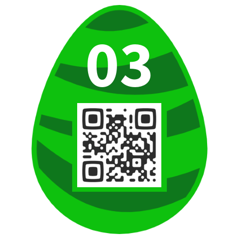

## Challenge

```
    Francesca's favourite letter is s
    Riley's favourite letter is o
    Ellie's favourite letter is a
    Vince's favourite letter is p
    Quintain's favourite letter is r
    Otto's favourite letter is i
    David's favourite letter is p
    Tom's favourite letter is l
    Paul's favourite letter is e
    Ulrich's favourite letter is y
    Henry's favourite letter is w
    Norman's favourite letter is h
    Louis' favourite letter is i
    Zane's favourite letter is s
    York's favourite letter is c
    Bob's favourite letter is h
    Meave's favourite letter is s
    Ian's favourite letter is o
    Sidney's favourite letter is g
    George's favourite letter is s
    Kitty's favourite letter is d
    Wilbert's favourite letter is h
    Adam's favourite letter is t
    Xander's favourite letter is i
    Callum's favourite letter is e
    Jack's favourite letter is r
```

## Solution

All names start with different letter and there are 26 of them, so lets
take the
first letter of the name as a hint for the positioning of the favourite
letters:

    ABCDEFGHIJKLMNOPQRSTUVWXYZ
    thepasswordishieroglyphics

put `hieroglyphics` into the egg-o-matic to get our egg5



