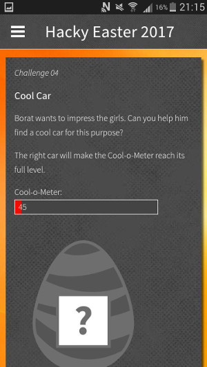
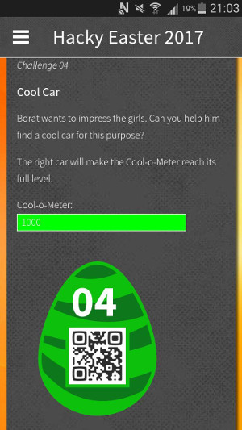

## Challenge

(Mobile Challenge)

Borat wants to impress the girls. Can you help him find a cool car for
his purpose?

## Solution

There is a meter we presumably need to fill, source code from decompiled
apk shows:

    function setLevel(l) {
      if (l>1000) l=1000;
      $('#level').css('width',(l/4)+'px');
      $('#level').css('background-color', 'rgba(' + Math.round((1000-l)*0.255) + ',' + Math.round(l*0.255) + ',0,1.0)');
      $('#level').text(""+Math.round(l));
    }
    function requestLevels() {
        window.location.href="ps://sensors";
    }
    function sensorFeedback(json) {
        var jsonResp = JSON.parse(json);
        setLevel(jsonResp.l);
        if (jsonResp.k) {
            decryptScrambledEggWithKey(jsonResp.k);
            clearInterval(intervalId);
        }
    }
    var intervalId = setInterval(requestLevels, 2000);
{: .language-javascript}

so it checks some sensor level, and looks like this needs to be 1000 to
get our egg

hmm, Borat and cars, we find this youtube video
https://www.youtube.com/watch?v=yAuu3xOsorQ
in which Borat wants a car with a pussy magnet ..hmm, magnets?

I held a fridge magnet to my phone and the meter filled right up to 1000
and gave me the egg

