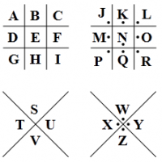

## Challenge

This crypto is not hard to crack.

## Solution

| Line | Cipher | Result |
|----------
| 1: | dancing men cipher | `BONTBBOK` |
| 2: | base64 decode | `BONTEAOK` |
| 3: | alphabet position | `BONTEBRK` |
| 4: | rot13 | `BANTEBOK` |
| 5: | pigpen cipher | `CONTEBOK` |
| 6: | reversed? | `BONTEBOA` |
| 7: | rot23? | `BOPTEBOK` |
| 8: | hex: | `BONYEBOK` |

* final solution: changed letters per line? If so: EABRAOCOBAPKNY
* Update: not working. Maybe I copied them wrong? Or somethnig else? :S
* Odd one out per position: `CAPYBARA`

pop this in egg-o-matic and get our egg:

