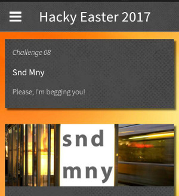
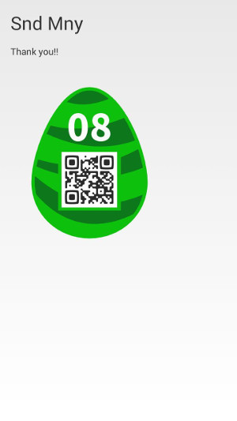

## Challenge

(Mobile Challenge)

Please, I'm begging you!

## Solution

find the relevant code in decompiled apk:

    public class SndActivity extends Activity {
        protected void onCreate(Bundle savedInstanceState) {
            super.onCreate(savedInstanceState);
            requestWindowFeature(1);
            getWindow().setFlags(AccessibilityNodeInfoCompat.ACTION_NEXT_HTML_ELEMENT, AccessibilityNodeInfoCompat.ACTION_NEXT_HTML_ELEMENT);
            setContentView(C0085R.layout.activity_snd);
            Intent intent = getIntent();
            String action = intent.getAction();
            String type = intent.getType();
            if ("android.intent.action.SEND".equals(action) && type != null && HTTP.PLAIN_TEXT_TYPE.equals(type)) {
                String text = intent.getStringExtra("android.intent.extra.TEXT");
                if (text != null && "c95259de1fd719814daef8f1dc4bd64f9d885ff0".equals(sha1(text.toLowerCase()))) {
                    ((TextView) findViewById(C0085R.id.sndTextView)).setText("Thank you!!");
                    ImageView image = (ImageView) findViewById(C0085R.id.sndImageView);
                    byte[] decodedString = Base64.decode(new StringBuilder(getString(C0085R.string.f16e) + "ROBVi").reverse().toString(), 0);
                    image.setImageBitmap(BitmapFactory.decodeByteArray(decodedString, 0, decodedString.length));
                }
            }
        }

    [..]

    }
{: .language-java}

`c95259de1fd719814daef8f1dc4bd64f9d885ff0` is the SHA-1 hash for the
string `money`

send this string to the app somehow?

ah, we notice there is now a new entry in the share menu to share to the
hackyeaster `SndActivity` app.

we share something random and get the following:

we presumably need to send just the string `money` downloaded an app
called *Clipboard Actions* which
lets you share anything on your clipboard

