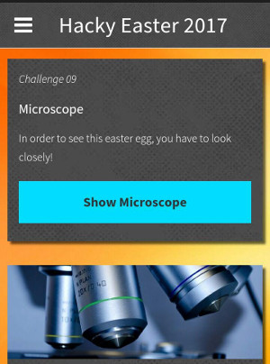
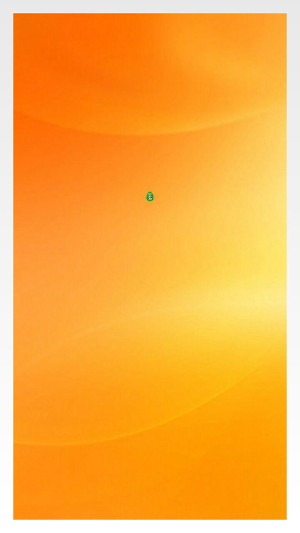

## Challenge

(Mobile Challenge)

In order to see this easter egg, you have to look closely!

## Solution

When we click the button, we see a page with a tiny tiny egg on it

We look at the source for the challenge from the decompiled APK

    package ps.hacking.hackyeaster.android;

    import android.app.Activity;
    import android.os.Bundle;
    import android.support.v4.view.accessibility.AccessibilityNodeInfoCompat;
    import android.webkit.HttpAuthHandler;
    import android.webkit.WebResourceError;
    import android.webkit.WebResourceRequest;
    import android.webkit.WebView;
    import android.webkit.WebViewClient;

    public class MicroscopeActivity extends Activity {

        /* renamed from: ps.hacking.hackyeaster.android.MicroscopeActivity.1 */
        class C00841 extends WebViewClient {
            C00841() {
            }

            public void onReceivedHttpAuthRequest(WebView view, HttpAuthHandler handler, String host, String realm) {
                handler.proceed("he2017", "egggghunthackinglab");
            }

            public void onReceivedError(WebView view, WebResourceRequest request, WebResourceError error) {
                view.loadDataWithBaseURL(null, "<html>&#128048;</html>", "text/html", "utf-8", null);
            }
        }

        protected void onCreate(Bundle savedInstanceState) {
            super.onCreate(savedInstanceState);
            requestWindowFeature(1);
            getWindow().setFlags(AccessibilityNodeInfoCompat.ACTION_NEXT_HTML_ELEMENT, AccessibilityNodeInfoCompat.ACTION_NEXT_HTML_ELEMENT);
            setContentView(C0085R.layout.activity_microscope);
            WebView webview = (WebView) findViewById(C0085R.id.microscopeWebView);
            webview.getSettings().setJavaScriptEnabled(true);
            webview.setWebViewClient(new C00841());
            webview.loadUrl("https://hackyeaster.hacking-lab.com/hackyeaster/challenge09_su6z47IoTT7.html".replace('6', '5'));
        }
    }
{: .language-java}

We see the webpage the app opens with the tiny egg on it:
https://hackyeaster.hacking-lab.com/hackyeaster/challenge09\_su5z47IoTT7.html

We open this page:

    <html>
      <head>
        <meta http-equiv="cache-control" content="max-age=0" />
        <meta http-equiv="cache-control" content="no-cache" />
        <meta http-equiv="expires" content="0" />
        <meta http-equiv="expires" content="Tue, 01 Jan 1980 1:00:00 GMT" />
        <meta http-equiv="pragma" content="no-cache" />
      </head>
      <body style="background: url('images/background.jpg') no-repeat center center fixed;  -webkit-background-size: cover; -moz-background-size: cover; -o-background-size: cover; background-size: cover;">
      <table width=100% height=100% border="0">
        <tr>
            <td style="text-align: center; vertical-align: middle;">
              

                
              

            </td>
        </tr>
      </table>
      </body>
    </html>
{: .language-html}

and find the location of the egg image and can view it full-size:

