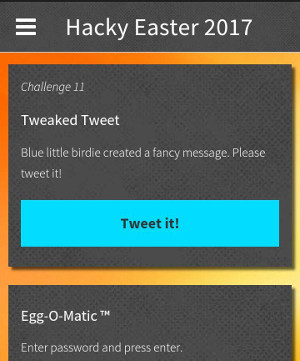

## Challenge

(Mobile Challenge)

Blue little birdie create a fancy message, please tweet it!

## Solution

When we click the button, it prepares a tweet for us:

We check the decompiled sources and see the code to generate the tweet:

    private void startTweakedTweet() {
        try {
            startActivity(new Intent("android.intent.action.VIEW", Uri.parse("https://twitter.com/intent/tweet?text=%23%EF%BC%A8a%EF%BD%83%EF%BD%8By%CE%95%EF%BD%81ste%EF%BD%92%E2%80%A9201%EF%BC%97%E2%80%A9%E2%85%B0%EF%BD%93%E2%80%80a%E2%80%84l%EF%BD%8F%EF%BD%94%E2%80%80%CE%BFf%E2%80%89%EF%BD%86un%EF%BC%81%E2%80%A8%23%D1%81tf%E2%80%88%23%EF%BD%88%EF%BD%81%CF%B2king-lab")));
        } catch (Exception e) {
            e.printStackTrace();
        }
    }
{: .language-java}

The tweet text:

    #ＨaｃｋyΕａsteｒ
201７
ⅰｓ a lｏｔ οf ｆun！
#сtf #ｈａϲking-lab

in hex:

    23efbca861efbd83efbd8b79ce95efbd81737465efbd92e280a9323031efbc97e280
    a9e285b0efbd93e2808061e280846cefbd8fefbd94e28080cebf66e28089efbd8675
    6eefbc81e280a823d1817466e2808823efbd88efbd81cfb26b696e672d6c6162

