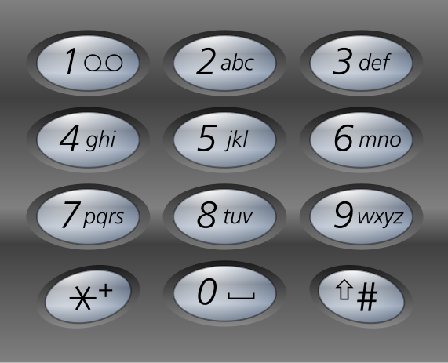

## Challenge

Your fellow inmate secretly passed you an old cell phone and a weird origami. The only thing on the phone are two stored numbers.

```
555-7747663 Link
555-7475464 Sara
```

Find the password and enter it in the Egg-o-Matic below. lowercase only, no spaces!


## Solution

Combine the telephone numbers with the dots on the origami and a T9 pad:



```
7747663 (Link)
1334322 (number of dots)
prisone (1 times '7' key = p, 3 times '7' key = r,  3 times '4' key = i,  etc)

7475464 (Sara)
3342321 (number of dots)
risking

```

this reads `prisonerisking`, enter this into egg-o-matic to get our egg


