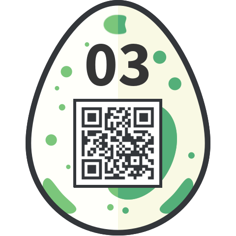

## Challenge

Tony the pony has encoded something for you. Decode his message and enter it in the egg-o-matic below!
Lowercase and spaces only, and special characters!

```
gn tn-gha87be4e
```

## Solution

Pony Coder refers to [Punycode](https://en.wikipedia.org/wiki/Punycode)

we can prepend `xn--` and use an online conversion tool such as [this one]() to translate `xn--gn tn-gha87be4e` to `gìn tônì©`

this doesn't work when we put it in the the egg-o-matic, but we try `gin tonic` and that does work



