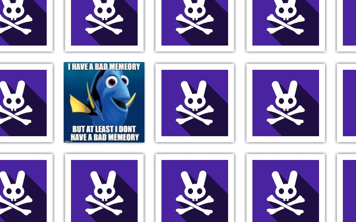

## Challenge

Fancy a round of memeory?



Click here to play.

## Solution

nspect the html, and can see the images on each of the cards:

```html
<div class="moduleLegespiel">
<figure id="legespiel_card_63" class="">
	<a href="#card_63">
      
	  
	  
	 </a>
	 
</figure><figure id="legespiel_card_58" class="">
	<a href="#card_58">
	  
	  
	  
	</a>
	
</figure><figure id="legespiel_card_84">
	<a href="#card_84">
	  
	  
	  
   </a>
	  
</figure><figure id="legespiel_card_73">
	<a href="#card_73">
	  
	  
	  
   </a>
   
</figure><figure id="legespiel_card_19">

[..]
```

so we just find the pairs and play the game to get our egg:


