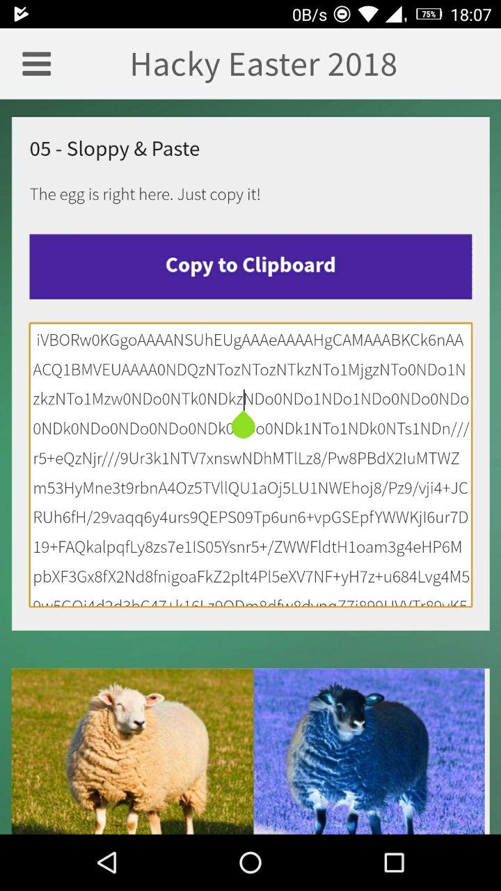

## Challenge

This was a mobille challenge.




## Solution

When we try to copy the text shown, it copies a different text


so we get the apk of the mobile app and decode it

```
apktool decode HackyEaster_9_5.0.1.apk
```

and find the string we are looking for in `assets/www/challenge05.html`


