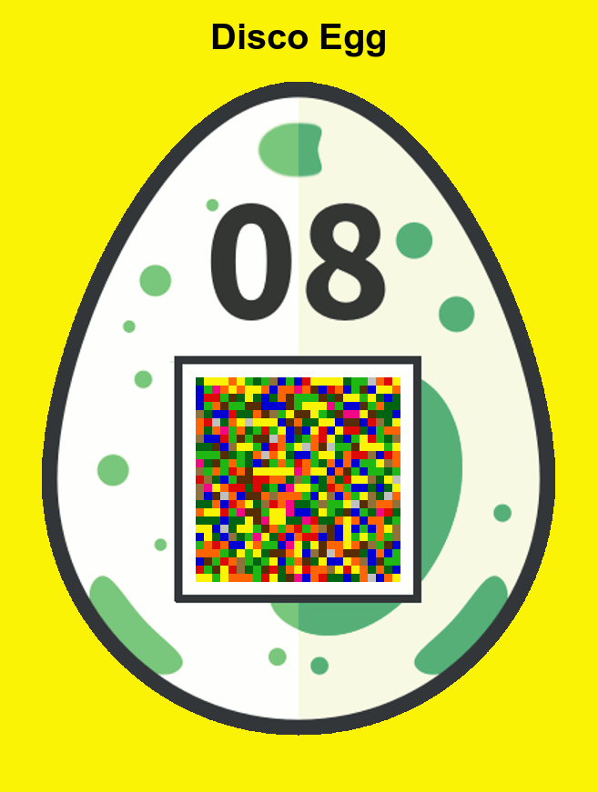

## Challenge

```
Make things as simple as possible but no simpler.

-- Albert Einstein
```

[disco.html](writeupfiles/chall08/disco.html)


## Solution

We are led to a site with an egg continually chaning colour




The element of the disco egg look as follows in the source:

```html
<div id="overlay">
<table><tr>
<td class="cyan black green darkgreen blue orange red darkgrey brown" style="background-color:#006412;"></td>
<td class="cyan red brown blue black green darkgrey" style="background-color:#FBF305;"></td>
<td class="cyan black blue red lightgrey" style="background-color:#FBF305;"></td>
<td class="darkgreen black tan cyan green blue" style="background-color:#FBF305;"></td>
<td class="brown blue darkgrey cyan mediumgrey lightgrey black darkgreen" style="background-color:#FF6403;"></td>
[..]
```

we notice that each element has either `black` or `white` in the list but not both. We let the background color reflect this and find our QR code


```bash
cat disco.html
| sed 's|</td>|</td>\n|g'
| sed 's|class=\".*white.*|class=\"white\" style=\"background-color:#FFFFFF;\"></td>|g'
| sed 's|class=\".*black.*|class=\"black\" style=\"background-color:#000000;\"></td>|g'
> disco2.html
```


