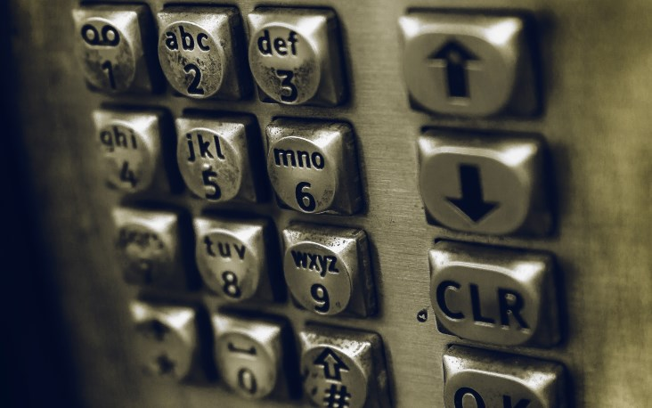
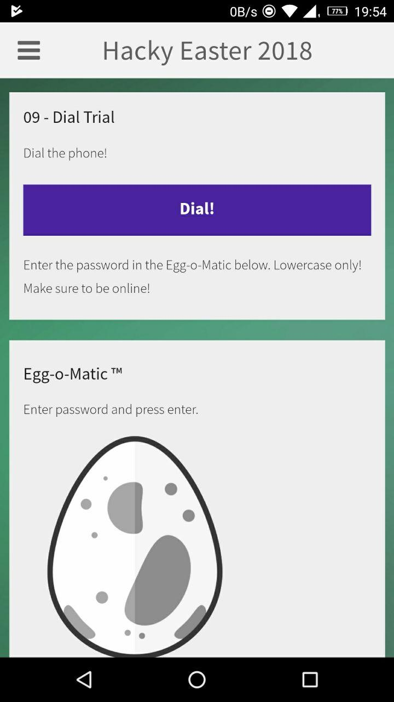
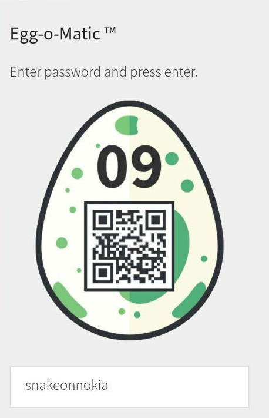

## Challenge

Another mobile challenge




## Solution

we find the [mp3 file](writeupfiles/chall09/dial.mp3) played by the app when hitting the button.

We convert it to [wav file](writeupfiles/chall09/dial.wav) and decode the DTMF tones using http://dialabc.com/sound/detect/index.html


```
472612252336262636253412
```

This looks like it could be similar to the first challenge, each pair of number representing a
letter, `47` means 4 times number 7 (letter `s` in T9)

```
47 26 12 25 23 36 26 26 36 25 34 12
s  n  a  k  e  o  n  n  o  k  i  a
```

Whoo! we enter `snakeonnokia` in the egg-o-matic to get our egg





