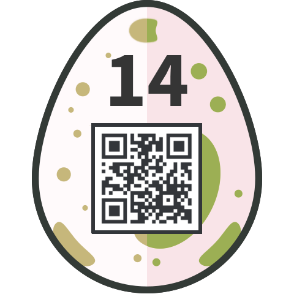

## Challenge

Same same...
...but different!
Upload the right files and make the server return an Easter egg!

```
http://whale.hacking-lab.com:4444
```

[upload.php.txt](writeupfiles/upload.php.txt)

## Solution

We get some PHP code:

```php
<?php
require __DIR__ . "/vendor/autoload.php"; // QR decoder library from https://github.com/khanamiryan/php-qrcode-detector-decoder

try {
    $qrcode1 = new QrReader($_FILES["file1"]["tmp_name"]);
    $answer1 = $qrcode1->text();
} catch(Exception $e) {
    exit("Error while reading the first QR.");
}

try {
    $qrcode2 = new QrReader($_FILES["file2"]["tmp_name"]);
    $answer2 = $qrcode2->text();
} catch(Exception $e) {
    exit("Error while reading the second QR.");
}

if(($answer1 == "Hackvent" && $answer2 == "Hacky Easter" or $answer1 == "Hacky Easter" && $answer2 == "Hackvent") && sha1_file($_FILES["file1"]["tmp_name"]) == sha1_file($_FILES["file2"]["tmp_name"])) {
    [SURPRISE]
}
else {
    echo ":-(";
}
?>
```

The PHP code seems to require that we upload two files which are QR codes with
the word 'Hackvent' in one and 'Hacky Easter' in the other, and that those
files should have identical sha1sums.

I just assumed it would accept PDFs without looking since the sha1 collision
for pdfs was pretty recently big news. Found
<https://github.com/nneonneo/sha1collider> as one of the top results in a search.


```
$ qrencode 'Hackvent' -o a.png
$ qrencode 'Hacky Easter' -o b.png
$ convert a.png a.pdf
$ convert b.png b.pdf
$ python3 sha1collider/collide.py a.pdf b.pdf --progressive
```

and got out two PDFs with identical hashes in under a second! Neat.

```
bdece875ca36c6505b0728cbeca7495db1a30246  out-a.pdf
bdece875ca36c6505b0728cbeca7495db1a30246  out-b.pdf
```




