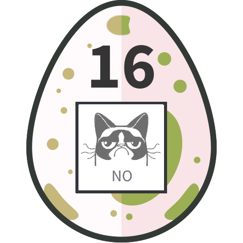

## Challenge

This one requires your best Git-Fu! Find the hidden egg in the repository.

[repo.zip](writeupfiles/chall16/repo.zip)

## Solution

The zip files contains a git repo with a number of images in it:

<table>


The egg with the QR code translates to `7dUDQDhMQkLYsQTMJq62`, but this is not a valid egg of course.

```bash
$ git log
commit b9e860f47fe6990cbda4ac5bb3d2829d2191f1eb (HEAD -> master)
Author: PS <ps@hacking-lab.com>
Date:   Tue Jan 23 05:43:16 2018 -0500

    even more funny images added

commit 3839c14d2863fd850794661677352305ea798eb6
Author: PS <ps@hacking-lab.com>
Date:   Tue Jan 23 05:43:15 2018 -0500

    more funny images added

commit 228b603ed45ddaf1b1d3fe502e168fa2508ee5ed
Author: PS <ps@hacking-lab.com>
Date:   Tue Jan 23 05:43:15 2018 -0500

    created the funny git meme repo
```

We rewind the commits to see if there is anything interesting

```bash
$ git reset HEAD~2
Unstaged changes after reset:
M       02.png
D       04.png
```

we see that image 2 was modified and another image deleted


but alas, this different egg (QRcode reads `qdUX0sgDVjWxiFNifHKE`) is still not what we are looking for..


```bash
$ git log --all --graph --oneline
* b9e860f (HEAD -> master) even more funny images added
| * 9a29769 (branch) branch created
|/
* 3839c14 more funny images added
* 228b603 created the funny git meme repo
```

So we see that a different branch was created at some point, but we don't find the egg here either.

```bash
$ cat .git/config
[core]
        repositoryformatversion = 0
        filemode = false
        bare = false
        logallrefupdates = true
        symlinks = false
        ignorecase = true
[user]
        name = PS
        email = ps@hacking-lab.com
```


```bash
$ cat .git/logs/HEAD                                                               [29-03-18 13:00:39]
0000000000000000000000000000000000000000 228b603ed45ddaf1b1d3fe502e168fa2508ee5ed PS <ps@hacking-lab.com> 1516704195 -0500      commit (initial): created the funny git meme repo
228b603ed45ddaf1b1d3fe502e168fa2508ee5ed 228b603ed45ddaf1b1d3fe502e168fa2508ee5ed PS <ps@hacking-lab.com> 1516704195 -0500      checkout: moving from master to temp
228b603ed45ddaf1b1d3fe502e168fa2508ee5ed b9820d55ce59799992648672a5a43fff4effd56b PS <ps@hacking-lab.com> 1516704195 -0500      commit: temp branch created
b9820d55ce59799992648672a5a43fff4effd56b 9d7c9b5a1c8773ea48caac90d05401679b0a8897 PS <ps@hacking-lab.com> 1516704195 -0500      commit: added one more image
9d7c9b5a1c8773ea48caac90d05401679b0a8897 228b603ed45ddaf1b1d3fe502e168fa2508ee5ed PS <ps@hacking-lab.com> 1516704195 -0500      checkout: moving from temp to master
228b603ed45ddaf1b1d3fe502e168fa2508ee5ed 3839c14d2863fd850794661677352305ea798eb6 PS <ps@hacking-lab.com> 1516704195 -0500      commit: more funny images added
3839c14d2863fd850794661677352305ea798eb6 3839c14d2863fd850794661677352305ea798eb6 PS <ps@hacking-lab.com> 1516704195 -0500      checkout: moving from master to branch
3839c14d2863fd850794661677352305ea798eb6 9a29769663d029f1b3ad83fec7e7f19ca1cf8e78 PS <ps@hacking-lab.com> 1516704195 -0500      commit: branch created
9a29769663d029f1b3ad83fec7e7f19ca1cf8e78 3839c14d2863fd850794661677352305ea798eb6 PS <ps@hacking-lab.com> 1516704196 -0500      checkout: moving from branch to master
3839c14d2863fd850794661677352305ea798eb6 b9e860f47fe6990cbda4ac5bb3d2829d2191f1eb PS <ps@hacking-lab.com> 1516704196 -0500      commit: even more funny images added

$ git log --all --branches --remotes --tags --reflog --oneline --graph
* b9e860f (HEAD -> master) even more funny images added
| * 9a29769 (branch) branch created
|/
* 3839c14 more funny images added
| * 9d7c9b5 added one more image
| * b9820d5 temp branch created
|/
* 228b603 created the funny git meme repo
```

```
git checkout 9d7c9b5a1c8773ea48caac90d05401679b0a8897
```

gives us another image, `tree.jpg` and yet another version of `02.png`:




Eventually discovered `git fsck` notes a dangling blob which is apparently some
piece of data that was included at one point but the commit was later removed or backed out.

```console
$ git fsck
Prüfe Objekt-Verzeichnisse: 100% (256/256), Fertig.
dangling blob dbab6618f6dc00a18b4195fb1bec5353c51b256f
$ git cat-file -p dbab6618f6dc00a18b4195fb1bec5353c51b256f > tmp.png
$ file tmp.png
tmp: PNG image data, 480 x 480, 8-bit colormap, non-interlaced
```


