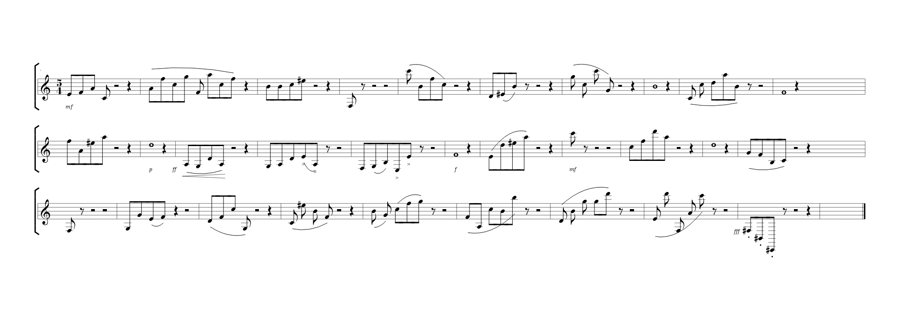

A lost symphony of the genius has reappeared.

Hint: count quavers, read semibreves

Once you found the solution, enter it in the egg-o-matic below.
Uppercase only, and no spaces!

## Solution

## Egg

