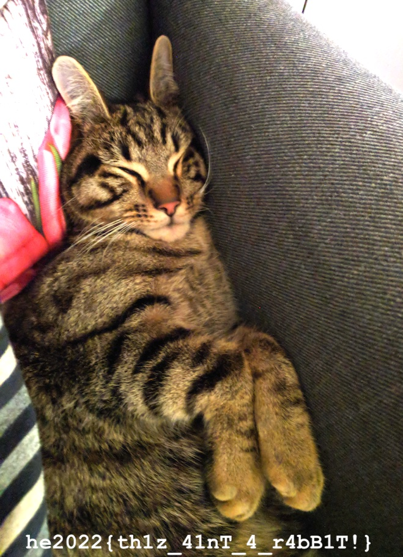

## Challenge

Everyone loves rabbits!

http://46.101.107.117:2201

Note: The service is restarted every hour at x:00.

Hint: It is not about the rabbit names.


## Solution

A website with pictures of bunnies..

```html
<!DOCTYPE html>
<html lang="en">
<head>
    <meta charset="UTF-8">
    <title>Fibonacci Rabbits</title>
    <link rel="stylesheet" href="style.css" />
    <script>
        if (document.location.search.match(/type=embed/gi)) {
            window.parent.postMessage("resize", "*");
        }
    </script>
</head>
<body translate="no">
    <h1>Fibonacci Rabbits</h1>
    <div id="gallery">
        <div><a href="#">Petal</a></div>
        <div><a href="#">Harley</a></div>
        <div><a href="#">Rosie</a></div>
        <div><a href="#">Petunia</a></div>
        <div><a href="#">Mortimer</a></div>
        <div><a href="#">Henry</a></div>
        <div><a href="#">Miffy</a></div>
        <div><a href="#">E.B.</a></div>
        <div><a href="#">Baxter</a></div>
        <div><a href="#">Archie</a></div>
        <div><a href="#">Murphy</a></div>
        <div><a href="#">Doc</a></div>
        <div><a href="#">Hopper</a></div>
        <div><a href="#">Fluffy</a></div>
        <div><a href="#">Daffodil</a></div>
        <div><a href="#">Buttons</a></div>
        <div><a href="#">Freddie</a></div>
        <div><a href="#">Roger</a></div>
        <div><a href="#">Bucky</a></div>
        <div><a href="#">Oliver</a></div>
        <div><a href="#">Olive</a></div>
        <div><a href="#">Bugs</a></div>
        <div><a href="#">Flower</a></div>
        <div><a href="#">Chester</a></div>
        <div><a href="#">Bubbles</a></div>
        <div><a href="#">Coco</a></div>
        <div><a href="#">Clover</a></div>
    </div>
</body>
</html>
```

These are all fibonacci numbers, specifically the Nth:

```
22, 25, 9, 16, 6, 1, 12, 18, 11, 10, 5, 28, 3, 20, 24, 23, 13, 17, 29, 19, 7, 4, 14, 21, 15, 26, 8
```


```
$ xsel -b | sed 's/^.*rabbit-//g;s/.jpg.*"#">/\t/g;s/<.*//g' | sort -k2
55	Archie
89	Baxter
610	Bubbles
514229	Bucky
3	Bugs
28657	Buttons
10946	Chester
21	Clover
121393	Coco
46368	Daffodil
317811	Doc
2584	E.B.
377	Flower
6765	Fluffy
233	Freddie
75025	Harley
1	Henry
2	Hopper
144	Miffy
8	Mortimer
5	Murphy
13	Olive
4181	Oliver
17711	Petal
987	Petunia
1597	Roger
34	Rosie
```

now what?

```
$ identify rabbit*
rabbit-10946.jpg JPEG 1280x853 1280x853+0+0 8-bit sRGB 272590B 0.000u 0:00.000
rabbit-121393.jpg JPEG 1280x853 1280x853+0+0 8-bit sRGB 292910B 0.000u 0:00.000
rabbit-13.jpg JPEG 1280x853 1280x853+0+0 8-bit sRGB 155592B 0.000u 0:00.000
rabbit-144.jpg JPEG 1280x853 1280x853+0+0 8-bit sRGB 163366B 0.000u 0:00.000
rabbit-1597.jpg JPEG 1280x960 1280x960+0+0 8-bit sRGB 585421B 0.000u 0:00.000
rabbit-17711.jpg JPEG 1280x719 1280x719+0+0 8-bit sRGB 511271B 0.000u 0:00.000
rabbit-1.jpg JPEG 1280x853 1280x853+0+0 8-bit sRGB 474764B 0.000u 0:00.000
rabbit-21.jpg JPEG 1280x853 1280x853+0+0 8-bit sRGB 111550B 0.000u 0:00.000
rabbit-233.jpg JPEG 1280x960 1280x960+0+0 8-bit sRGB 369672B 0.000u 0:00.000
rabbit-2584.jpg JPEG 1280x853 1280x853+0+0 8-bit sRGB 170860B 0.000u 0:00.000
rabbit-28657.jpg JPEG 1280x853 1280x853+0+0 8-bit sRGB 262431B 0.000u 0:00.000
rabbit-2.jpg JPEG 1280x853 1280x853+0+0 8-bit sRGB 226245B 0.000u 0:00.000
rabbit-317811.jpg JPEG 1072x1500 1072x1500+0+0 8-bit sRGB 131508B 0.000u 0:00.000
rabbit-34.jpg JPEG 1280x960 1280x960+0+0 8-bit sRGB 475212B 0.000u 0:00.000
rabbit-377.jpg JPEG 1280x887 1280x887+0+0 8-bit sRGB 373786B 0.000u 0:00.000
rabbit-3.jpg JPEG 1280x853 1280x853+0+0 8-bit sRGB 436276B 0.000u 0:00.000
rabbit-4181.jpg JPEG 1280x853 1280x853+0+0 8-bit sRGB 264739B 0.000u 0:00.000
rabbit-46368.jpg JPEG 1280x853 1280x853+0+0 8-bit sRGB 372928B 0.000u 0:00.000
rabbit-514229.jpg JPEG 1280x768 1280x768+0+0 8-bit sRGB 325076B 0.000u 0:00.000
rabbit-55.jpg JPEG 1280x720 1280x720+0+0 8-bit sRGB 367224B 0.000u 0:00.000
rabbit-5.jpg JPEG 1280x853 1280x853+0+0 8-bit sRGB 159823B 0.000u 0:00.000
rabbit-610.jpg JPEG 1280x720 1280x720+0+0 8-bit sRGB 151790B 0.000u 0:00.000
rabbit-6765.jpg JPEG 1280x853 1280x853+0+0 8-bit sRGB 507688B 0.000u 0:00.000
rabbit-75025.jpg JPEG 1280x853 1280x853+0+0 8-bit sRGB 276286B 0.000u 0:00.000
rabbit-89.jpg JPEG 1280x853 1280x853+0+0 8-bit sRGB 270403B 0.000u 0:00.000
rabbit-8.jpg JPEG 1280x844 1280x844+0+0 8-bit sRGB 569582B 0.000u 0:00.000
rabbit-987.jpg JPEG 1280x806 1280x806+0+0 8-bit sRGB 385891B 0.000u 0:00.000
```

they're all the same width. hmm.


Oh! we are way overthinking this, it looks like the 27th fibonacci number is missing, that is `196418`, so let's see if there is an image under `images/rabbit-196418.jpg`

Bingo!




