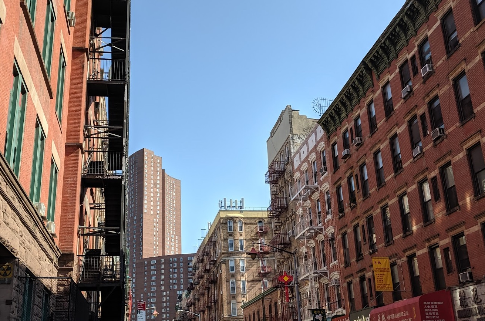

## Challenge

I made a nice city trip. Find out where I was!

🚩 Flag

- street's name in lowercase and without spaces
- district or city name is not enough, we need the street
- example: Main Rd -> he2022{mainrd}

## Solution

Seems like we have to find out the location of this image, but it does not appear to be geotagged, hmm..

Helena's first thought was manhattan, and looking at the shop front in bottom right corner it looks like "Manhattan Flo" Florist?

Googling Manhattan florist chinatown gets us to manhattanflorist.com, on Bayard street

