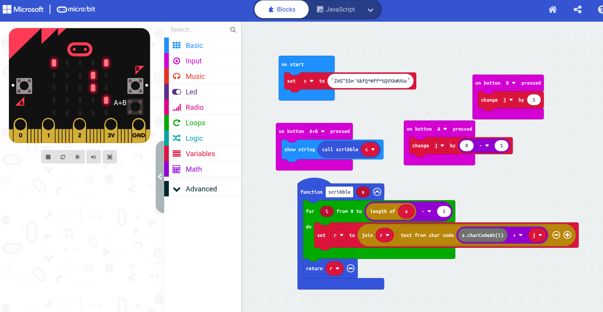
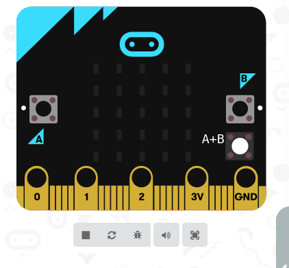

## Challenge


I got this hex dump, but I don't know what it is.

Any idea?

[LEDS.hex](writeupfiles/leds.hex)


## Solution

We have a peek at the file:

```
:020000040000FA
:0400000A9901C0DEBA
:10000000C0070000D1060000D1000000B1060000CA
:1000100000000000000000000000000000000000E0
:100020000000000000000000000000005107000078
:100030000000000000000000DB000000E500000000
:10004000EF000000F9000000030100000D010000B6
:1000500017010000210100002B0100003501000004
[..]
```

Some Googling reveals this to be code for the micro.bit

We can import the hex file here: https://makecode.microbit.org/



We can also get it in javascript form:

```js
input.onButtonPressed(Button.A, function () {
    j += 0 - 1
})
input.onButtonPressed(Button.AB, function () {
    basic.showString("" + (scribble(c)))
})
input.onButtonPressed(Button.B, function () {
    j += 5
})
function scribble (s: string) {
    for (let i = 0; i <= s.length - 1; i++) {
        r = "" + r + String.fromCharCode(s.charCodeAt(i) + j)
    }
    return r
}
let r = ""
let j = 0
let c = ""
c = "ZW$\"$$m`%&fQ^#ff^%QV%h#U%o"

```

The LEDs seem to display the `c` variable if we press the "A+B" button

We know that this likely has to become the flag, so `Z` should become `h`

So basically a caesar shift, but funner to do the solution on the microbit:



We need to setup a shift of 14, so we hit the B buttin 3 times to make 15, then hit the A button to subtract one, then hit the "A+B" button to show the solution on the LEDs :)


