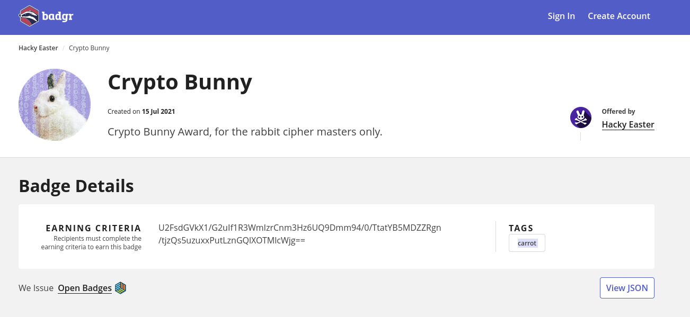

## Challenge

View my verified achievement from (HOP)².


## Solution

Sounds like a badging system, checking the exifdata confirms:

```
$ exiftool writeupfiles/crypto_bunny.png | grep open
Openbadges                      : {.  "@context": "https://w3id.org/openbadges/v2",.  "type": "Assertion",.  "id": "https://api.eu.badgr.io/public/assertions/aeT2h9EWTHyiqHk7Yx4X4Q",.  "badge": "https://api.eu.badgr.io/public/badges/LaGEPKu1R2W5mg221vdV4g",.  "image": "https://api.eu.badgr.io/public/assertions/aeT2h9EWTHyiqHk7Yx4X4Q/image",.  "verification": {.    "type": "HostedBadge".  },.  "issuedOn": "2021-07-14T22:00:00+00:00",.  "recipient": {.    "hashed": true,.    "type": "email",.    "identity": "sha256$821158dcab489c45156fd110707bd2ec51d4365b1f34ed42ddde612383717338",.    "salt": "9529d9c5e91b4475a52b46fbe37cb55d".  },.  "extensions:recipientProfile": {.    "@context": "https://openbadgespec.org/extensions/recipientProfile/context.json",.    "type": [.      "Extension",.      "extensions:RecipientProfile".    ],.    "name": "Hacky Easter".  }.}
```



Looking at [one of the urls](https://eu.badgr.com/public/assertions/aeT2h9EWTHyiqHk7Yx4X4Q) they have an 'earning criteria' of:


```
U2FsdGVkX1/G2uIf1R3WmIzrCnm3Hz6UQ9Dmm94/0/TtatYB5MDZZRgn/tjzQs5uzuxxPutLznGQlXOTMlcWjg==
```


Which looks interesting when b64 decoded

```
0000000        746c6153        5f5f6465        1fe2dac6        98d61dd5
          S   a   l   t   e   d   _   _   F   Z   b  us   U  gs   V can
0000020        790aeb8c        943e1fb7        9be6d043        f4d33fde
         ff   k  nl   y   7  us   > dc4   C   P   f esc   ^   ?   S   t
0000040        01d66aed        65d9c0e4        d8fe2718        6ece42f3
          m   j   V soh   d   @   Y   e can   '   ~   X   s   B   N   n
0000060        3e71ecce        71ce4beb        93739590        8e165732
          N   l   q   >   k   K   N   q dle nak   s dc3   2   W syn  so
```

Googling the `salted__` I find other ctf posts (lmao)

> this shows that this is OpenSSL’s salted format. We know that the file is symmetrically encrypted with OpenSSL because of this format, but the output doesn’t tell us which ciphers were used or any other helpful info.
> -- https://nineninenine.blog/


After trying all the available SSL ciphers and digest combos and ending up with nothing, we figure we must be missing something..

```bash
for i in $(openssl list -1 -cipher-commands); do
  echo U2FsdGVkX1/G2uIf1R3WmIzrCnm3Hz6UQ9Dmm94/0/TtatYB5MDZZRgn/tjzQs5uzuxxPutLznGQlXOTMlcWjg== |
    openssl enc -d -a -$i -pass pass:carrot -pbkdf2 -md md5 -nopad;
done

```
but what are we missing?!

The text on the badge reads "for the rabbit cipher masters only." ..rabbit cipher, is this a hint!

And [Rabbit Cipher](https://en.wikipedia.org/wiki/Rabbit_(cipher)) exists!

We can decrypt it easily with a site like [this](https://www.browserling.com/tools/rabbit-decrypt), entering "carrot" as the password/key

```
Congrats, here's the flag: he2022{b4dg3_4w4rd3d}
```


