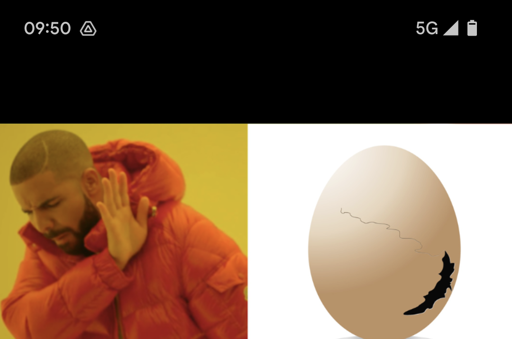

## Challenge

I had a secret Easter egg on my screenshot, but I cropped it, hehe!

Kudos to former Hacky Easter winner Retr0id - he's one of the researches who found the vulnerability in question!



## Solution

This sounds like the recen [aCROPalypse vulnerability](https://en.wikipedia.org/wiki/ACropalypse).

We use [acropalypse.app](https://acropalypse.app/) to recover the cropped part of the image.

We try some phone models until we have success with the "Google Pixel 6" setting


we than scan the QR code to get the flag

```bash
$ zbarimg screenshot-recovered.png
QR-Code:he2023{4cr0pa_wh4t?}
scanned 1 barcode symbols from 1 images in 0.24 seconds

```

