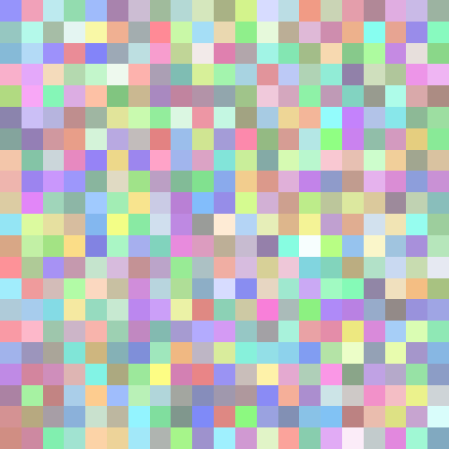

## Challenge

Very bouncy, indeed, but not in a castle.

Try http://ch.hackyeaster.com:2308


## Solution

Hmm...

We get to a website where we can look around, we seem to be in a patch of grass in a town, and pastel coloured eggs drop down on us and start bouncing.

Source:

```html
<!DOCTYPE html>
<html lang="en">
<head>
<title>three.js webgl - materials - cube refraction [balls]</title>
<meta charset="utf-8">
<meta name="viewport"
	content="width=device-width, user-scalable=no, minimum-scale=1.0, maximum-scale=1.0">
<link type="text/css" rel="stylesheet" href="main.css">
<script src="background.png.js"></script>
</head>
<body>


	<script type="module">

			import * as THREE from './three.module.js';
            import Stats from './stats.module.js';


			const VSTEP = 20;		// Speed increase per step
			const VDAMP = 0.98;		// Damping because of friction
			const EGGSIZE = 250;	// egg size in pixel

			let container, stats;

			let camera, scene, renderer;

			const eggs = [];

			let mouseX = 0, mouseY = 0;

			let windowHalfX = window.innerWidth / 2;
			let windowHalfY = window.innerHeight / 2;

			document.addEventListener( 'mousemove', onDocumentMouseMove, false );

			// Clock for smooth movement on slower PCs
			const clock = new THREE.Clock();

			init();
			animate();

			function init() {

				// canvas
				container = document.createElement( 'div' );
				document.body.appendChild( container );

				// stats
				stats = new Stats();
				container.appendChild( stats.dom );

				// camera
				camera = new THREE.PerspectiveCamera( 60, window.innerWidth / window.innerHeight, 1, 100000 );
				camera.position.z = 3200;

				// scene
				scene = new THREE.Scene();
				scene.background = new THREE.CubeTextureLoader()
					.setPath( 'textures/cube/' )
					.load( [ 'posx.jpg', 'negx.jpg', 'posy.jpg', 'negy.jpg', 'posz.jpg', 'negz.jpg' ] );

				// geometry (egg)
				// points - (x, y) pairs are rotated around the y-axis
				var points = [];
				var SIZE = 150;
				for ( var deg = 0; deg <= 180; deg += 6 ) {
					var rad = Math.PI * deg / 180;
    				var point = new THREE.Vector2( ( 0.72 + .08 * Math.cos( rad ) ) * Math.sin( rad ) * EGGSIZE, - Math.cos( rad ) * EGGSIZE ); // the "egg equation"
    				//console.log( point ); // x-coord should be greater than zero to avoid degenerate triangles; it is not in this formula.
    				points.push( point );
				}
				const eggGeometry =  new THREE.LatheBufferGeometry( points, 32 );

				// generate all eggs
				for ( let x = 0; x < 21; x ++ ) {
						for ( let z = 0; z < 21; z ++ ) {
						const mesh = new THREE.Mesh( eggGeometry, getRandomMaterial(x, z));

						mesh.position.x = x * 10000 / 21 - 5000;
						mesh.position.y = 5000 + Math.random() * 5000;
						mesh.position.z = z *  10000 / 21 - 5000;
						mesh.userData.vy = 0;

						scene.add(mesh);
						eggs.push( mesh );
					}
				}


				renderer = new THREE.WebGLRenderer();
				renderer.setPixelRatio( window.devicePixelRatio );
				renderer.setSize( window.innerWidth, window.innerHeight );
				container.appendChild( renderer.domElement );

				//

				window.addEventListener( 'resize', onWindowResize, false );

			}

			function getRandomColor(x, z) {
				let pos = (x + z * 21) * 6;
				let val = parseInt(hex.substring(pos, pos + 6), 16);
				console.log("x:" + x + ", z: " + z + ", val: " + val )
				return val;
			}

			function getRandomMaterial(x, z) {
				let material = new THREE.MeshBasicMaterial( {color:  getRandomColor(x, z), envMap: scene.background, refractionRatio: 0.95 } );
	 			material.envMap.mapping = THREE.CubeRefractionMapping;
				return material;
			}

			function onWindowResize() {
				windowHalfX = window.innerWidth / 2;
				windowHalfY = window.innerHeight / 2;
				camera.aspect = window.innerWidth / window.innerHeight;
				camera.updateProjectionMatrix();
				renderer.setSize( window.innerWidth, window.innerHeight );
			}

			function onDocumentMouseMove( event ) {
				mouseX = ( event.clientX - windowHalfX ) * 10;
				mouseY = ( event.clientY - windowHalfY ) * 10;
			}

			//
			function animate() {
				requestAnimationFrame( animate );
				render();
				stats.update();
			}

			function render() {
				const delta = clock.getDelta();
				for ( let i = 0, il = eggs.length; i < il; i ++ ) {
					const egg = eggs[i];
					egg.position.y += egg.userData.vy;
					egg.userData.vy -= delta * VSTEP;

					if (egg.position.y < 0) {
						egg.position.y = - egg.position.y;
						egg.userData.vy = - egg.userData.vy * VDAMP;
					}
				}

				camera.position.x += ( mouseX - camera.position.x ) * .05;
				camera.position.y += ( - mouseY - camera.position.y ) * .05;

				camera.lookAt( scene.position );
				renderer.render( scene, camera );

			}

		</script>

</body>
</html>

```

and `background.png.js`:

```javascript
hex="9694fb96c7c186bad7f9b0cbb1da818b84ad84a49df3c6aaeeb5aedccca394e5f4d8a786fd9298a1edfcafcbd9f99aa5a1b3ebbf8ae5ab82a3d49293d08e83f1a1b9b4f9eab3daf6e4a8faf8a7f6cbbff6947fb584c4a69c84efe286f8dcfa9fc2f0a5afca97ef9b9ca7ccedfdb8ca9c95bcd3859ea6f2a2b7a980cd89a1bdeaefa6bda69d91fbf4dbbb85f6b7b6b4ded0989fcbd6dac997fca0d5bae6e0a0a3e384a792f4d3bcb884dbe59ec6acaaa599cf8ebbc28483a79ea681efaf93dcafe4f5f2ea8c97b4d9afdcade3bf8e8ee89e89e789c09d97fb8db6a6d7bd9ffbdd87c599aeb2fba6f5e9a1ccb5c880e5d7deb5b3aacee98bb1daa1e3d19fbbfbf9f8a68384f9c3f6cbfdc1a59fb6a2d4f3d99683f689b59ea0cafe83b7ef8283e2c5e4cdfbd8c096dbbff8b4acceb67f82f3e5fdcc8fc9e1cefcd3a7a883adf0b0929da9b6eef9ee81c580e1e49ab8a9e1edd88ae0dac3a2edb4f3fe86aaf6c5d7bbddc8c0a2c7e9d19dd0b285b1b6aca9809fbdfcbdb7a0edd399ccbdd3a3adafbddfe1fdb2adcab891c9faafc2bcbb9c86eea0e389f8e48e89eaa3a6afeec49295d08ddabb87efc188c17f8fd99ce89bb9f1b793f4ffa2e8f9a0bb9cff8a96f79dceab9fb4a989c093ed9ce38282ffa3c8bb9fc4cacbe5d0dfee81d3bdbba4c9b8d5decb9ff883bab09fe7bcfdfd84b1d6da80de9eafb4b0b4d9d5c9f8a7c0d5977fbdb3c1849fdbf7e29bbeeba1b5ed82bb97b980d5be89e2e88bdd98eb95afde97ebf2a6a69bd1f0b882d380b3a3a6a080978da6f58ad5e7bda5def6f2eae9d7f099b393a8ed96a4d0e592dba3c581e18f82bdfb9a9c99dc9cbfacc1c48daec6df8983b3abfebeb6c5e98587868dbb7f8af89e92cda9b285ead8b0df80afa3f4ad92a6adc4f7e2a49cd782e4d98aaaec968de8feebd5bdaf97f0aea3d7dcff8cd1b5d49af4d9ec9c9a93f3a098adde88839ff0fed3f38c8fef8bb2a6aba8d3e1a0c48aa2a382fc89acc9ee9af2cd8ed5fb90b4d4f5c7bbd0d7bcdf898df1cdc9a496c7c587f1dbc9bebaaf989d8cf980d099d2d7dcffe6f9dba1f4e5e1949bf0c9dba7cbe394ba8384aaa6db998bd2b0d5e6eeb89580aad7d097e7d6c2f87fd9a3a1a593dfe7fef2a98a8bf59aa2e0e1f4c7bbdde4bbae9683e6b2bcc9f6d4a7beeed696d69d94d6fab2e0b0d9cda08fddb68c87fde1eec7d89fe8cfaabbb9a8f2db8dd2ece4a9d0f5af998290b4fba39bf19b85dfb9d7a3bd89b0d3b58ef2a7f3b699b4e7e5b9f7cec283e9bdec8af4f396f7fefe81d5dfcaa9f48cf181e9a2a5819df2afcfb8ab8ecf89c2e788cdaecad4b5ce8daef7d9b091ecd6bf9ab693fcfc90ff83f9c8d28f9bcabcc69bc0a0d0b8fe8482d4bca1fac2af8af8e48da9b4e3a6fa97e6cce4e781c2f4e1abf5e49eabedb18c87c98b9181a982d3c1c482fcca82efe7c0b2c19c8fdce89fe0ad9196c3eebbad8185fab7b981e3ede880ecfec88aa589cec9c7bc8282fbecf8b1889787fef0adfb9fcfdfbd989b8fb2c3e891bea9cdfdcce5b2eddbc99cd2e1eefaf6cab2e1c89186a697abcad98ada94a1b5c0a2e4f291c9eabdaec2cbcce0ade1e7a492c58ae3b0c69baefce988e7ead39abff1cf9ada8dd59d8a9bf1e4b4a0c4dfc9d9f1f0e0be938a88a6cef7e8fcaeb5a9caf4bec5dde184e288dec9bae7998ceae7dfdced95e8d9a9aa8db996e5ce7fa1a6908d9edbc0d2b296fdefa890dbc8dcb0f4be839992dcdafdb3a596cb97e2a5ebf28cc7a4d0a0f8d49cb3a188fabf8ad789efb5f3ac8c839ddea189ea97d9c2a0c991d589bebb9dce9db6e6bbe6e9f2a8c2819fa5e48fe8b587b7e38c9dc6ced4d7d9fdfb81a9c0"
```


not sure what to do with that..

BouncyCastle is an encryption library ?

But this is a forensics challenge

no clue..

ok, the `hex` variable in background.png.js is used to generate "random" colours. This it definitely weird, let's look at that more closely. We see it uses six charachters of this string as a colour value for the eggs, and it accesses them as if it's a square of 21 by 21 pixels.. Let's recreate all these colours as an image//

```python
from PIL import Image
import textwrap

hexstring="9694fb96c7c186bad7f9b0cbb1da818b84ad84a49df3c6aaeeb5aedccca394e5f4d8a786fd9298a1edfcafcbd9f99aa5a1b3ebbf8ae5ab82a3d49293d08e83f1a1b9b4f9eab3daf6e4a8faf8a7f6cbbff6947fb584c4a69c84efe286f8dcfa9fc2f0a5afca97ef9b9ca7ccedfdb8ca9c95bcd3859ea6f2a2b7a980cd89a1bdeaefa6bda69d91fbf4dbbb85f6b7b6b4ded0989fcbd6dac997fca0d5bae6e0a0a3e384a792f4d3bcb884dbe59ec6acaaa599cf8ebbc28483a79ea681efaf93dcafe4f5f2ea8c97b4d9afdcade3bf8e8ee89e89e789c09d97fb8db6a6d7bd9ffbdd87c599aeb2fba6f5e9a1ccb5c880e5d7deb5b3aacee98bb1daa1e3d19fbbfbf9f8a68384f9c3f6cbfdc1a59fb6a2d4f3d99683f689b59ea0cafe83b7ef8283e2c5e4cdfbd8c096dbbff8b4acceb67f82f3e5fdcc8fc9e1cefcd3a7a883adf0b0929da9b6eef9ee81c580e1e49ab8a9e1edd88ae0dac3a2edb4f3fe86aaf6c5d7bbddc8c0a2c7e9d19dd0b285b1b6aca9809fbdfcbdb7a0edd399ccbdd3a3adafbddfe1fdb2adcab891c9faafc2bcbb9c86eea0e389f8e48e89eaa3a6afeec49295d08ddabb87efc188c17f8fd99ce89bb9f1b793f4ffa2e8f9a0bb9cff8a96f79dceab9fb4a989c093ed9ce38282ffa3c8bb9fc4cacbe5d0dfee81d3bdbba4c9b8d5decb9ff883bab09fe7bcfdfd84b1d6da80de9eafb4b0b4d9d5c9f8a7c0d5977fbdb3c1849fdbf7e29bbeeba1b5ed82bb97b980d5be89e2e88bdd98eb95afde97ebf2a6a69bd1f0b882d380b3a3a6a080978da6f58ad5e7bda5def6f2eae9d7f099b393a8ed96a4d0e592dba3c581e18f82bdfb9a9c99dc9cbfacc1c48daec6df8983b3abfebeb6c5e98587868dbb7f8af89e92cda9b285ead8b0df80afa3f4ad92a6adc4f7e2a49cd782e4d98aaaec968de8feebd5bdaf97f0aea3d7dcff8cd1b5d49af4d9ec9c9a93f3a098adde88839ff0fed3f38c8fef8bb2a6aba8d3e1a0c48aa2a382fc89acc9ee9af2cd8ed5fb90b4d4f5c7bbd0d7bcdf898df1cdc9a496c7c587f1dbc9bebaaf989d8cf980d099d2d7dcffe6f9dba1f4e5e1949bf0c9dba7cbe394ba8384aaa6db998bd2b0d5e6eeb89580aad7d097e7d6c2f87fd9a3a1a593dfe7fef2a98a8bf59aa2e0e1f4c7bbdde4bbae9683e6b2bcc9f6d4a7beeed696d69d94d6fab2e0b0d9cda08fddb68c87fde1eec7d89fe8cfaabbb9a8f2db8dd2ece4a9d0f5af998290b4fba39bf19b85dfb9d7a3bd89b0d3b58ef2a7f3b699b4e7e5b9f7cec283e9bdec8af4f396f7fefe81d5dfcaa9f48cf181e9a2a5819df2afcfb8ab8ecf89c2e788cdaecad4b5ce8daef7d9b091ecd6bf9ab693fcfc90ff83f9c8d28f9bcabcc69bc0a0d0b8fe8482d4bca1fac2af8af8e48da9b4e3a6fa97e6cce4e781c2f4e1abf5e49eabedb18c87c98b9181a982d3c1c482fcca82efe7c0b2c19c8fdce89fe0ad9196c3eebbad8185fab7b981e3ede880ecfec88aa589cec9c7bc8282fbecf8b1889787fef0adfb9fcfdfbd989b8fb2c3e891bea9cdfdcce5b2eddbc99cd2e1eefaf6cab2e1c89186a697abcad98ada94a1b5c0a2e4f291c9eabdaec2cbcce0ade1e7a492c58ae3b0c69baefce988e7ead39abff1cf9ada8dd59d8a9bf1e4b4a0c4dfc9d9f1f0e0be938a88a6cef7e8fcaeb5a9caf4bec5dde184e288dec9bae7998ceae7dfdced95e8d9a9aa8db996e5ce7fa1a6908d9edbc0d2b296fdefa890dbc8dcb0f4be839992dcdafdb3a596cb97e2a5ebf28cc7a4d0a0f8d49cb3a188fabf8ad789efb5f3ac8c839ddea189ea97d9c2a0c991d589bebb9dce9db6e6bbe6e9f2a8c2819fa5e48fe8b587b7e38c9dc6ced4d7d9fdfb81a9c0"

# lets interpret this as a bunch of pixels in hex format (6 characters per pixel)
outimg = Image.new( 'RGB', (21,21), "black")
pixels_out = outimg.load()


for i in range(0,len(hexstring),6):
    color = hexstring[i:i+6]
    pix = int(i/6)

    x = int(pix/21)
    z = int(pix%21)

    pixels_out[(x,z)]=(int(color[0:2],16),int(color[2:4],16),int(color[4:6],16))

# save the image
outimgname = "bouncy.png"
outimg = outimg.resize((500,500), resample=Image.NEAREST)
outimg.save(outimgname,"png")
```

This gives us an image, but nothing obvious there



We pass it through [StegOnline](https://stegonline.georgeom.net/upload), and whaddya know, one of the bitplanes contains a QR code! ..shoulda known, it's always the LSB..


