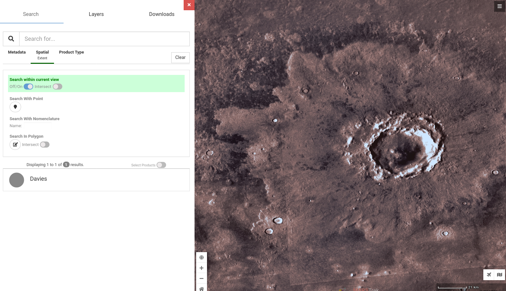

## Challenge

My friend went to France and sent me coordinates of interesting things he found.

Three of them look legit, but one does not make sense to me.

```
48.998 2.008
45.960 0.090
43.579 1.524
45.007 4.335
```

🚩 Flag

- the first word of the thing you find
- six lowercase letters
- wrapped in flag format, e.g. he2023{thingy}


## Solution

We look up the coordinates in Google Maps, 3 of them are for french observatories, the fourth on (`45.960 0.090`) leads us to an empty field, so that must be the one that doesn't make sense.

```
48.998 2.008  # Observatoire de Triel
45.960 0.090  # ??
43.579 1.524  # Le sentier des planètes
45.007 4.335  # Planète Mars Observatoire Hubert Reeves
```

Since the other 3 lead to observatories, what if the coordinates are to another planet? Let's try Mars first since that is part of the name of one of the observatories.

We use NASA's website [Mars Trek](https://trek.nasa.gov/mars/) and go to the coordinates `45.960 0.090`. There is a crater right there! We find it's name is Davies crater.



And that is indeed the flag!

