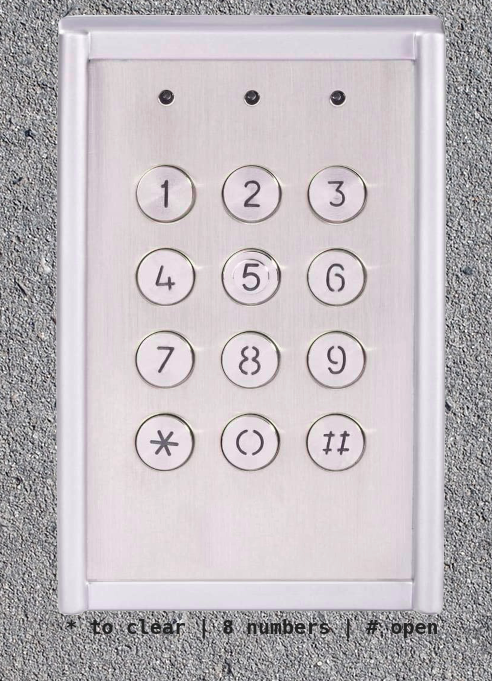
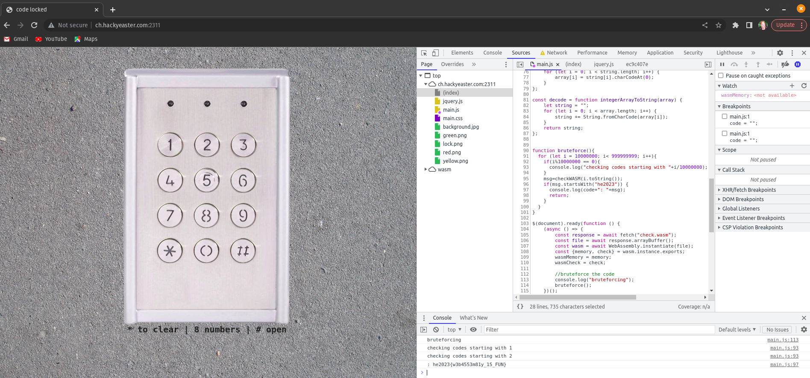

## Challenge

Open the code lock at http://ch.hackyeaster.com:2311 to get your 🚩 flag.

Note: The service is restarted every hour at x:00.

## Solution

We get a website with a number pad, where we are told to enter 8 numbers, then hit '#' to open



```html
<!DOCTYPE html>
<html lang="en">

<head>
    <title>code locked</title>
    <meta charset="utf-8">
    <meta name="viewport" content="width=device-width, user-scalable=no, minimum-scale=1.0, maximum-scale=1.0">
    <link type="text/css" rel="stylesheet" href="main.css">
    <script src="jquery.js"></script>
    <script src="main.js"></script>
</head>

<body>
    <div id="codelock">
        
        <map name="lockmap">
            <area shape="circle" coords="111,178,32" alt="1" onclick="press('1')">
            <area shape="circle" coords="200,178,32" alt="1" onclick="press('2')">
            <area shape="circle" coords="283,178,32" alt="1" onclick="press('3')">
            <area shape="circle" coords="111,261,32" alt="1" onclick="press('4')">
            <area shape="circle" coords="200,261,32" alt="1" onclick="press('5')">
            <area shape="circle" coords="283,261,32" alt="1" onclick="press('6')">
            <area shape="circle" coords="111,345,32" alt="1" onclick="press('7')">
            <area shape="circle" coords="200,345,32" alt="1" onclick="press('8')">
            <area shape="circle" coords="283,345,32" alt="1" onclick="press('9')">
            <area shape="circle" coords="111,427,32" alt="1" onclick="press('*')">
            <area shape="circle" coords="200,427,32" alt="1" onclick="press('0')">
            <area shape="circle" coords="283,427,32" alt="1" onclick="press('#')">
        </map>
        
        
        
    </div>
    <div id="text">
        * to clear | 8 numbers | # open
    </div>
</body>

</html>
```


We look through the javascript

```javascript

code = "";

var audioDelete = new Audio("delete.mp3");
audioDelete.load();
var audioClick = new Audio("click.wav");
audioClick.load();
var audioSuccess = new Audio("success.mp3");
audioSuccess.load();
var audioFail = new Audio("fail.mp3");
audioFail.load();

wasmMemory = null;
wasmCheck = null;

function checkWASM(code) {
    const pinArray = new Int32Array(wasmMemory.buffer, 0, 26);
    encode(code, pinArray);
    wasmCheck(pinArray.byteOffset, pinArray.length);
    return decode(pinArray);
}

function play(file) {
    a = new Audio(file);
    a.play();
}

function press(input) {
    if (input == "*") {
        play("delete.mp3");
        $("#yellow").show(0).delay(200).hide(0);
        code = "";
    } else if (input == "#") {
        msg = checkWASM(code);
        if (msg.startsWith("he2023")) {
            play("success.mp3");
            audioSuccess.play();
            $("#green").show(0).delay(5000).hide(0);
        } else {
            play("fail.mp3");
            $("#red").show(0).delay(1000).hide(0);
        }
        setTimeout(function() {alert(msg);}, 200)
    } else {
        $("#yellow").show(0).delay(200).hide(0);
        play("click.wav");
        code = (code + input).substr(-8, 8);
    }
}

const encode = function stringToIntegerArray(string, array) {
    for (let i = 0; i < string.length; i++) {
        array[i] = string[i].charCodeAt(0);
    }
};

const decode = function integerArrayToString(array) {
    let string = "";
    for (let i = 0; i < array.length; i++) {
        string += String.fromCharCode(array[i]);
    }
    return string;
};

$(document).ready(function () {
    (async () => {
        const response = await fetch("check.wasm");
        const file = await response.arrayBuffer();
        const wasm = await WebAssembly.instantiate(file);
        const {memory, check} = wasm.instance.exports;
        wasmMemory = memory;
        wasmCheck = check;
    })();
})
```

and see that it's calling a WASM code file to parse the input number. So we can start by ignoring all of the JS and just focusing on the WASM bits:

```console
wasm2js check.wasm
```

wasm2js from binaryen can be installed from at least the fedora repositories, and produces nicer, easier to read javascript:

```javascript
function Table(ret) {
  // grow method not included; table is not growable
  ret.set = function(i, func) {
    this[i] = func;
  };
  ret.get = function(i) {
    return this[i];
  };
  return ret;
}

  var bufferView;
  var base64ReverseLookup = new Uint8Array(123/*'z'+1*/);
  for (var i = 25; i >= 0; --i) {
    base64ReverseLookup[48+i] = 52+i; // '0-9'
    base64ReverseLookup[65+i] = i; // 'A-Z'
    base64ReverseLookup[97+i] = 26+i; // 'a-z'
  }
  base64ReverseLookup[43] = 62; // '+'
  base64ReverseLookup[47] = 63; // '/'
  /** @noinline Inlining this function would mean expanding the base64 string 4x times in the source code, which Closure seems to be happy to do. */
  function base64DecodeToExistingUint8Array(uint8Array, offset, b64) {
    var b1, b2, i = 0, j = offset, bLength = b64.length, end = offset + (bLength*3>>2) - (b64[bLength-2] == '=') - (b64[bLength-1] == '=');
    for (; i < bLength; i += 4) {
      b1 = base64ReverseLookup[b64.charCodeAt(i+1)];
      b2 = base64ReverseLookup[b64.charCodeAt(i+2)];
      uint8Array[j++] = base64ReverseLookup[b64.charCodeAt(i)] << 2 | b1 >> 4;
      if (j < end) uint8Array[j++] = b1 << 4 | b2 >> 2;
      if (j < end) uint8Array[j++] = b2 << 6 | base64ReverseLookup[b64.charCodeAt(i+3)];
    }
  }
function initActiveSegments(imports) {
  base64DecodeToExistingUint8Array(bufferView, 1024, "WAAAAFQAAAAGAAAABQAAAAAAAAAKAAAATQAAAEEAAAADAAAAUwAAAAAAAAAAAAAABwAAAAoAAABbAAAADgAAAAEAAABIAAAAawAAAAQAAAAHAAAAZgAAAHAAAABjAAAAfgAAAEwAAAAAAAAAAAAAAFgAAABUAAAABgAAAAUAAAAAAAAACgAAAE0AAABBAAAAAwAAAFMAAAAAAAAAAAAAAAcAAAAKAAAAWwAAAA4AAAABAAAASAAAAGsAAAAEAAAABwAAAGYAAABwAAAAYwAAAH4AAABMAAAAAAAAAAAAAABZAAAAbwAAAHUAAAAgAAAAZAAAAGkAAABkAAAAIAAAAG4AAABvAAAAdAAAACAAAABvAAAAcAAAAGUAAABuAAAAIAAAAHQAAABoAAAAZQAAACAAAABsAAAAbwAAAGMAAABrAAAAIQAAAA==");
}
function asmFunc(env) {
 var buffer = new ArrayBuffer(16777216);
 var HEAP8 = new Int8Array(buffer);
 var HEAP16 = new Int16Array(buffer);
 var HEAP32 = new Int32Array(buffer);
 var HEAPU8 = new Uint8Array(buffer);
 var HEAPU16 = new Uint16Array(buffer);
 var HEAPU32 = new Uint32Array(buffer);
 var HEAPF32 = new Float32Array(buffer);
 var HEAPF64 = new Float64Array(buffer);
 var Math_imul = Math.imul;
 var Math_fround = Math.fround;
 var Math_abs = Math.abs;
 var Math_clz32 = Math.clz32;
 var Math_min = Math.min;
 var Math_max = Math.max;
 var Math_floor = Math.floor;
 var Math_ceil = Math.ceil;
 var Math_trunc = Math.trunc;
 var Math_sqrt = Math.sqrt;
 var abort = env.abort;
 var nan = NaN;
 var infinity = Infinity;
 var global$0 = 5244240;
 var global$1 = 0;
 var global$2 = 0;
 function $1($0) {
  $0 = $0 | 0;
  var $3_1 = 0;
  $3_1 = global$0 - 16 | 0;
  HEAP32[($3_1 + 12 | 0) >> 2] = $0;
  HEAP32[($3_1 + 8 | 0) >> 2] = 0;
  label$1 : {
   label$2 : while (1) {
    if (!((HEAP32[($3_1 + 8 | 0) >> 2] | 0 | 0) < (26 | 0) & 1 | 0)) {
     break label$1
    }
    HEAP32[($3_1 + 4 | 0) >> 2] = ((HEAP32[($3_1 + 8 | 0) >> 2] | 0) + 4 | 0 | 0) % (8 | 0) | 0;
    HEAP32[(1136 + ((HEAP32[($3_1 + 8 | 0) >> 2] | 0) << 2 | 0) | 0) >> 2] = (HEAP32[(1024 + ((HEAP32[($3_1 + 8 | 0) >> 2] | 0) << 2 | 0) | 0) >> 2] | 0) ^ (HEAP32[((HEAP32[($3_1 + 12 | 0) >> 2] | 0) + ((HEAP32[($3_1 + 4 | 0) >> 2] | 0) << 2 | 0) | 0) >> 2] | 0) | 0;
    HEAP32[($3_1 + 8 | 0) >> 2] = (HEAP32[($3_1 + 8 | 0) >> 2] | 0) + 1 | 0;
    continue label$2;
   };
  }
  HEAP32[$3_1 >> 2] = 0;
  label$3 : {
   label$4 : while (1) {
    if (!((HEAP32[$3_1 >> 2] | 0 | 0) < (26 | 0) & 1 | 0)) {
     break label$3
    }
    HEAP32[((HEAP32[($3_1 + 12 | 0) >> 2] | 0) + ((HEAP32[$3_1 >> 2] | 0) << 2 | 0) | 0) >> 2] = HEAP32[(1136 + ((HEAP32[$3_1 >> 2] | 0) << 2 | 0) | 0) >> 2] | 0;
    HEAP32[$3_1 >> 2] = (HEAP32[$3_1 >> 2] | 0) + 1 | 0;
    continue label$4;
   };
  }
  return;
 }

 function $2($0) {
  $0 = $0 | 0;
  var $3_1 = 0;
  $3_1 = global$0 - 16 | 0;
  HEAP32[($3_1 + 12 | 0) >> 2] = $0;
  HEAP32[($3_1 + 8 | 0) >> 2] = 0;
  label$1 : {
   label$2 : while (1) {
    if (!((HEAP32[($3_1 + 8 | 0) >> 2] | 0 | 0) < (26 | 0) & 1 | 0)) {
     break label$1
    }
    HEAP32[((HEAP32[($3_1 + 12 | 0) >> 2] | 0) + ((HEAP32[($3_1 + 8 | 0) >> 2] | 0) << 2 | 0) | 0) >> 2] = HEAP32[(1248 + ((HEAP32[($3_1 + 8 | 0) >> 2] | 0) << 2 | 0) | 0) >> 2] | 0;
    HEAP32[($3_1 + 8 | 0) >> 2] = (HEAP32[($3_1 + 8 | 0) >> 2] | 0) + 1 | 0;
    continue label$2;
   };
  }
  return;
 }

 function $3($0) {
  $0 = $0 | 0;
  var $3_1 = 0;
  $3_1 = global$0 - 16 | 0;
  global$0 = $3_1;
  HEAP32[($3_1 + 12 | 0) >> 2] = $0;
  HEAP32[($3_1 + 8 | 0) >> 2] = 48;
  label$1 : {
   label$2 : {
    if (!((HEAP32[(HEAP32[($3_1 + 12 | 0) >> 2] | 0) >> 2] | 0 | 0) != ((HEAP32[($3_1 + 8 | 0) >> 2] | 0) + 2 | 0 | 0) & 1 | 0)) {
     break label$2
    }
    $2(HEAP32[($3_1 + 12 | 0) >> 2] | 0 | 0);
    break label$1;
   }
   HEAP32[($3_1 + 8 | 0) >> 2] = HEAP32[(HEAP32[($3_1 + 12 | 0) >> 2] | 0) >> 2] | 0;
   label$3 : {
    label$4 : {
     if (!((HEAP32[((HEAP32[($3_1 + 12 | 0) >> 2] | 0) + 4 | 0) >> 2] | 0 | 0) == ((HEAP32[($3_1 + 8 | 0) >> 2] | 0) + 7 | 0 | 0) & 1 | 0)) {
      break label$4
     }
     HEAP32[($3_1 + 8 | 0) >> 2] = HEAP32[((HEAP32[($3_1 + 12 | 0) >> 2] | 0) + 4 | 0) >> 2] | 0;
     label$5 : {
      if (!((HEAP32[((HEAP32[($3_1 + 12 | 0) >> 2] | 0) + 8 | 0) >> 2] | 0 | 0) != ((HEAP32[($3_1 + 8 | 0) >> 2] | 0) - 3 | 0 | 0) & 1 | 0)) {
       break label$5
      }
      $2(HEAP32[($3_1 + 12 | 0) >> 2] | 0 | 0);
      break label$1;
     }
     HEAP32[($3_1 + 8 | 0) >> 2] = HEAP32[((HEAP32[($3_1 + 12 | 0) >> 2] | 0) + 8 | 0) >> 2] | 0;
     label$6 : {
      if (!((HEAP32[((HEAP32[($3_1 + 12 | 0) >> 2] | 0) + 12 | 0) >> 2] | 0 | 0) == (HEAP32[($3_1 + 8 | 0) >> 2] | 0 | 0) & 1 | 0)) {
       break label$6
      }
      label$7 : {
       if (!((HEAP32[((HEAP32[($3_1 + 12 | 0) >> 2] | 0) + 16 | 0) >> 2] | 0 | 0) == ((HEAP32[($3_1 + 8 | 0) >> 2] | 0) - 6 | 0 | 0) & 1 | 0)) {
        break label$7
       }
       label$8 : {
        if (!((HEAP32[((HEAP32[($3_1 + 12 | 0) >> 2] | 0) + 20 | 0) >> 2] | 0 | 0) == ((HEAP32[($3_1 + 8 | 0) >> 2] | 0) - 5 | 0 | 0) & 1 | 0)) {
         break label$8
        }
        if (!((HEAP32[((HEAP32[($3_1 + 12 | 0) >> 2] | 0) + 24 | 0) >> 2] | 0 | 0) == ((HEAP32[($3_1 + 8 | 0) >> 2] | 0) - 2 | 0 | 0) & 1 | 0)) {
         break label$8
        }
        if (!((HEAP32[((HEAP32[($3_1 + 12 | 0) >> 2] | 0) + 28 | 0) >> 2] | 0 | 0) == ((HEAP32[($3_1 + 8 | 0) >> 2] | 0) - 1 | 0 | 0) & 1 | 0)) {
         break label$8
        }
        $1(HEAP32[($3_1 + 12 | 0) >> 2] | 0 | 0);
        break label$1;
       }
      }
     }
     break label$3;
    }
    $2(HEAP32[($3_1 + 12 | 0) >> 2] | 0 | 0);
    break label$1;
   }
   $2(HEAP32[($3_1 + 12 | 0) >> 2] | 0 | 0);
  }
  global$0 = $3_1 + 16 | 0;
  return;
 }

 function $4() {
  return global$0 | 0;
 }

 function $5($0) {
  $0 = $0 | 0;
  global$0 = $0;
 }

 function $6($0) {
  $0 = $0 | 0;
  var $1_1 = 0;
  $1_1 = (global$0 - $0 | 0) & -16 | 0;
  global$0 = $1_1;
  return $1_1 | 0;
 }

 function $7() {
  global$2 = 5244240;
  global$1 = (1356 + 15 | 0) & -16 | 0;
 }

 function $8() {
  return global$0 - global$1 | 0 | 0;
 }

 function $9() {
  return global$2 | 0;
 }

 function $10() {
  return global$1 | 0;
 }

 function $11() {
  return 1352 | 0;
 }

 bufferView = HEAPU8;
 initActiveSegments(env);
 var FUNCTION_TABLE = Table([]);
 function __wasm_memory_size() {
  return buffer.byteLength / 65536 | 0;
 }

 return {
  "memory": Object.create(Object.prototype, {
   "grow": {

   },
   "buffer": {
    "get": function () {
     return buffer;
    }

   }
  }),
  "check": $3,
  "__indirect_function_table": FUNCTION_TABLE,
  "__errno_location": $11,
  "emscripten_stack_init": $7,
  "emscripten_stack_get_free": $8,
  "emscripten_stack_get_base": $9,
  "emscripten_stack_get_end": $10,
  "stackSave": $4,
  "stackRestore": $5,
  "stackAlloc": $6
 };
}

var retasmFunc = asmFunc(  { abort: function() { throw new Error('abort'); }
  });
export var memory = retasmFunc.memory;
export var check = retasmFunc.check;
export var __errno_location = retasmFunc.__errno_location;
export var emscripten_stack_init = retasmFunc.emscripten_stack_init;
export var emscripten_stack_get_free = retasmFunc.emscripten_stack_get_free;
export var emscripten_stack_get_base = retasmFunc.emscripten_stack_get_base;
export var emscripten_stack_get_end = retasmFunc.emscripten_stack_get_end;
export var stackSave = retasmFunc.stackSave;
export var stackRestore = retasmFunc.stackRestore;
export var stackAlloc = retasmFunc.stackAlloc;
```


This bit looks promising:

```console
$ echo WAAAAFQAAAAGAAAABQAAAAAAAAAKAAAATQAAAEEAAAADAAAAUwAAAAAAAAAAAAAABwAAAAoAAABbAAAADgAAAAEAAABIAAAAawAAAAQAAAAHAAAAZgAAAHAAAABjAAAAfgAAAEwAAAAAAAAAAAAAAFgAAABUAAAABgAAAAUAAAAAAAAACgAAAE0AAABBAAAAAwAAAFMAAAAAAAAAAAAAAAcAAAAKAAAAWwAAAA4AAAABAAAASAAAAGsAAAAEAAAABwAAAGYAAABwAAAAYwAAAH4AAABMAAAAAAAAAAAAAABZAAAAbwAAAHUAAAAgAAAAZAAAAGkAAABkAAAAIAAAAG4AAABvAAAAdAAAACAAAABvAAAAcAAAAGUAAABuAAAAIAAAAHQAAABoAAAAZQAAACAAAABsAAAAbwAAAGMAAABrAAAAIQAAAA== | base64 -d
XT
MAS
[Hkfpc~LXT
MAS
[Hkfpc~LYou did not open the lock!%
```

but it's not, yet.

Ok, let's change gears, since we cannot reverse the wasm code. An 8 digit code is within bruteforcing range. But we don't want to bruteforce the server, so can we do it locally?

We tried a bunch of ways to run the code locally, but what ended up being easiest was using Chrome. In Developer tools you can use local overrides ([instructions](https://www.debugbear.com/blog/devtools-local-overrides)), so we can adapt the `main.js` to bruteforce the code for us.

```javascript

[..]

function bruteforce(){
  for (let i = 10000000; i< 999999999; i++){  // let's hope the code doesnt start with 0 so we dont have to figure out leftpadding
    if(i%10000000 == 0){
      console.log("checking codes starting with "+i/10000000);
    }
    msg=checkWASM(i.toString());
    if(msg.startsWith("he2023")) {
      console.log(code+": "+msg);
      return;
    }
  }
}

$(document).ready(function () {
    (async () => {
        const response = await fetch("check.wasm");
        const file = await response.arrayBuffer();
        const wasm = await WebAssembly.instantiate(file);
        const {memory, check} = wasm.instance.exports;
        wasmMemory = memory;
        wasmCheck = check;

        //bruteforce the code
        console.log("bruteforcing");
        bruteforce();
    })();

})

```
{:file main.js}

and keep an eye on our console, and after about 10 seconds we get our flag!

```
main.js:99 bruteforcing
main.js:32 searching..
main.js:35 chacking codes starting with 0
main.js:35 chacking codes starting with 1
main.js:35 chacking codes starting with 2
main.js:46 29660145: he2023{w3b4553m81y_15_FUN}
```



whoo!
