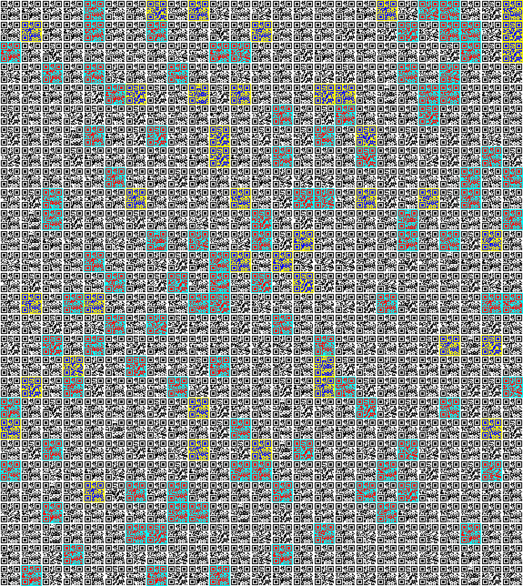

## Challenge

A warm, sunny day - perfect weather for a picnic! But what's that - did the bunnies really bring the nice quilt from the living room as a blanket?



## Solution

First, split the quilt up into individual QR codes:

```console
convert quilt.png -crop 69x69 +repage +adjoin 'quilt-%03d.png'
```

Let's read them all, it can't be this easy right?

```console
for i in quilt-*; do zbarimg $i 2>/dev/null| grep QR-Code | sed 's/QR-Code://g' >> quilt.txt; done
```

But maybe it is?

```console
cat quilt.txt | tr -d '\n'
```

which results in:

> Hello! Do you love quilts? Well... I am pretty sure I do! They are so pretty.. my oh my, but look at me getting lost in idle thoughts! You are here for an egg, right? I bet you are. Where did I put it? Ah, here he2023{this_is_th... No, sorry, that is not it. That was an old one, can you believe it? This maybe? he2023{I_need_this_egg_for_breakfast}. Nooo.. sorry! But I am fairly sure this is it, right here he2023{Qu1lt1ng_is_quit3_relaxing!} Yeah, that should be it. Sorry. I am rambling, but it is so nice to have a visitor appreciating my quilts! They are a lot of work, and I love all of them. Please, do not leave so soon. How about a cookie? Would you like a cookie? Hey, where are you going?

And the third one is it.
